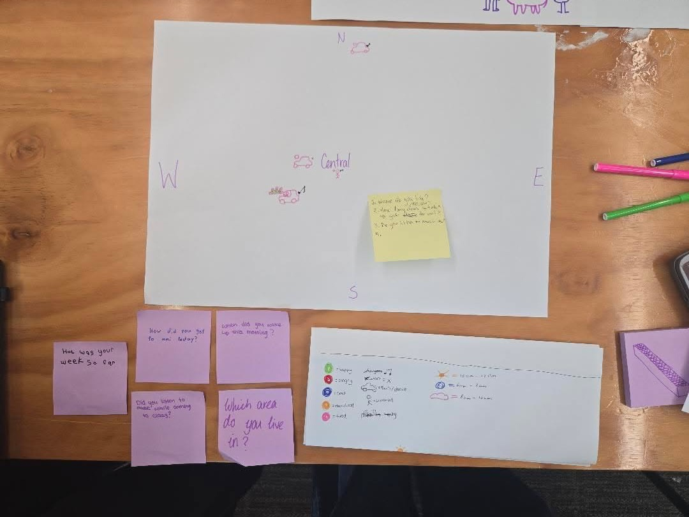
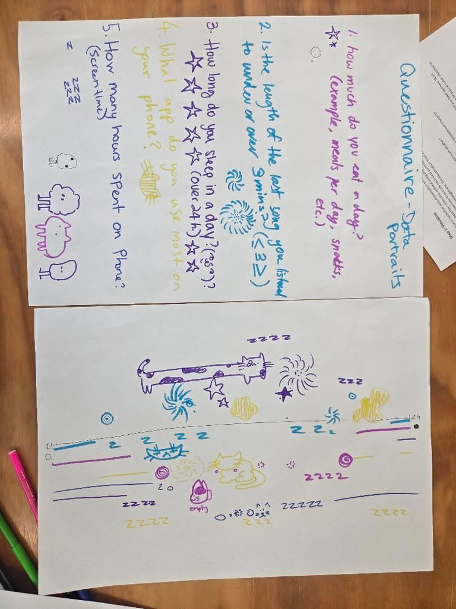

# Week 01

[← Back to Home](../index.md)

# In Class Experiment
In our first class of the semester we learnt about different ways to visualise data, and how the use of shapes, colours, icons, and more can be used to visualise data in creative and interesting ways – especially ways that you wouldn’t normally think off. In class we got into groups of 4 and then came up with 5 questions and then as a group we came up with a way to visualise the answers to the question with colours and icons.

 My group asked the questions of
-	How was your week so far?
-	How did you get to uni today?
-	When did you wake up this morning?
-	Did you listen to music on the way to uni today?
-	Which area do you live in?
The way we visualised this data was the following
-	A color: green = happy, red = angry, blue = sad, orange = okay, pink = tired
-	A icon:  car = bus/car, person = walking,
-	A icon: moon = 4-9am, cloud = 9-12am, sun = after 12pm
-	A icon: music note = yes, cross = no
-	Location of all of the icons based on compass on where in Auckland.

We then paired up with another group and tried to determine what their questions were based on their visual data. 

From their drawings Showcased above, we determined that the length of the cat was how they felt during the day, the lines in the timestamp were how long they slept for, and we thought that the spiral thing was how big their family was. Afterwards we got back with the groups and explain them to each other. It turned out that their group had the following questions

-	How much do you eat a day?
-	The length of the last song they listened to?
-	What app do you use most on your phone?
-	How many hours did you spend on your phone?
-	How long do you sleep during the day

I think that we did pretty good and were able two of the questions right, I think the use of the cats to display the app they used the most was really creative. The length of the song being displayed as the spiral things was really confusing and we still had to get it explained it to us twice before we fully understood, with how many spirals being the length in minutes.

# Solo Experiment 1 

## Track
During the day I decided to track often I would pick up my phone. I wanted to do this, as I find that I am someone who gets distracted a lot, often times when doing something, I'll end up picking up my phone and just doomscrolling when I should be doing work. 

## Collection & Visualisation
To collect the data, I carried a peice of A4 paper with me and made a quick note each time I picked up my phone. I recorded the time, what I was doing before picking it up, and how I felt in that moment. I also wrote the main reason for using it, such as checking messages, social media, music, or just unlocking it without a clear purpose. After collecting all of the data I created a time map from 9am - my usual wake up time, to 11pm - my usual bed time. I then created cirlces with colours, based on my emotions and the time I spent on the phone.

## What Did I notice
I think that the biggest concern that I noticed was how much I got distracted by my phone throughout the day, often while doing work I would just pull out my phone and start doom scrolling. I already knew it was a problem however I didn't realise just how big that problem was though.

## Data Collection Choices
For data collection, I chose to record only the moment I picked up the phone, rather than everything I did while using it. This keeps the data focused on the why I picked up my phone rather than the full behaviour of me using my phone. However, this also leaves out some details, such as how different apps influenced my attention or how long I spent scrolling after opening them.

## Data Humanism & Dear Data
This exercise relates to data humanism because it focuses on personal experience rather than large datasets. The goal I tried to get is reflection, not perfect accuracy. It is similar to Dear Data by Giorgia Lupi and Stefanie Posavec. In that project, they tracked small parts of their daily lives and visualised them with simple drawings. Like my experiment, it turns everyday behaviour into personal data.

## Further Reflections
This exercise made me more aware of how often distractions happen during a normal day. Before tracking it, I knew that I would get distracted often, but I did not realise how often it actually was. Seeing the number written down made the pattern much clearer. It also showed how large a role my phone plays in interrupting my focus.

What data and visual aspects from Experiment 1 did you choose to work with, and why?
How did you decide which interactive elements to use?
What can a viewer learn by interacting with your sketch that they couldn't from your hand-drawn portrait?
Did you use vibe coding or other tools in your process? What did you learn from this?
What would you develop further with more time?
Any other reflections?

## AI Usage Statement

*Document any use of AI tools under an AI Usage Statement heading. Explain which tools you used and describe how you used them. Reference any AI-generated content (see [QuickCite](https://auckland.libguides.com/referencing-generative-ai-tools) for guidance).*

