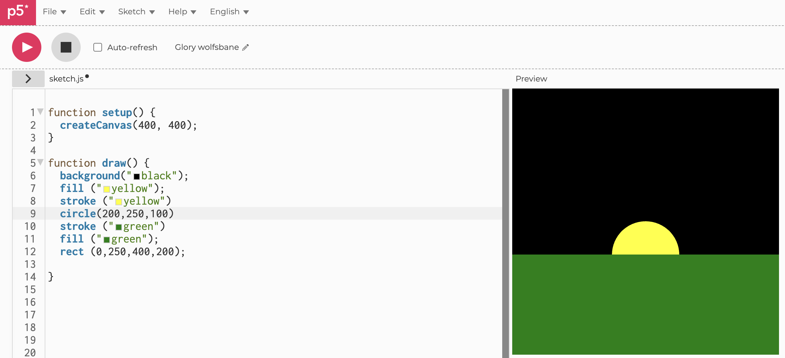
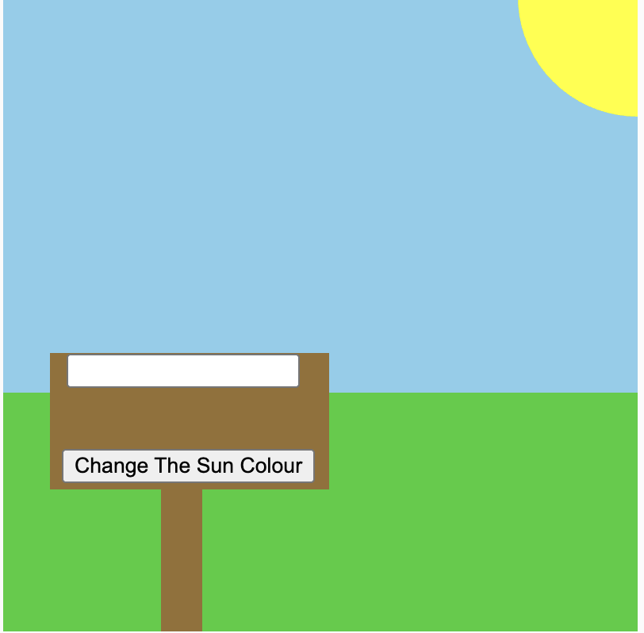
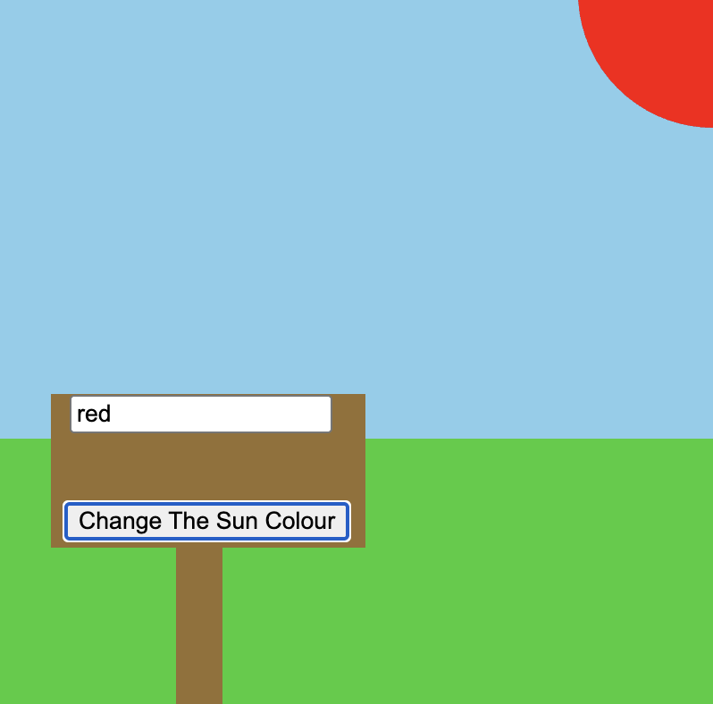
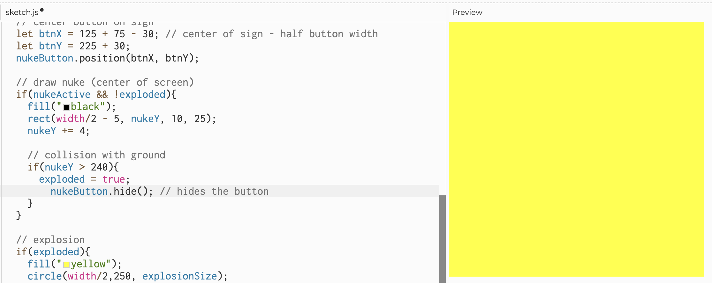
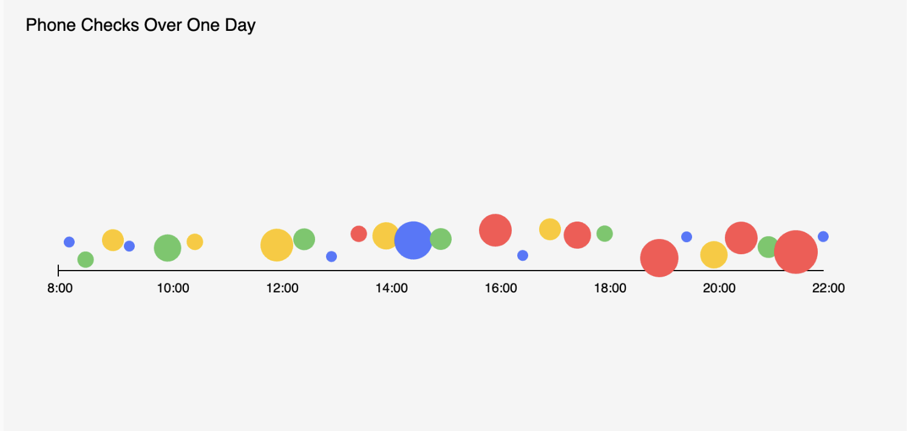
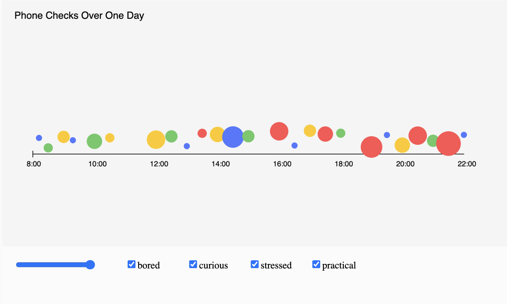
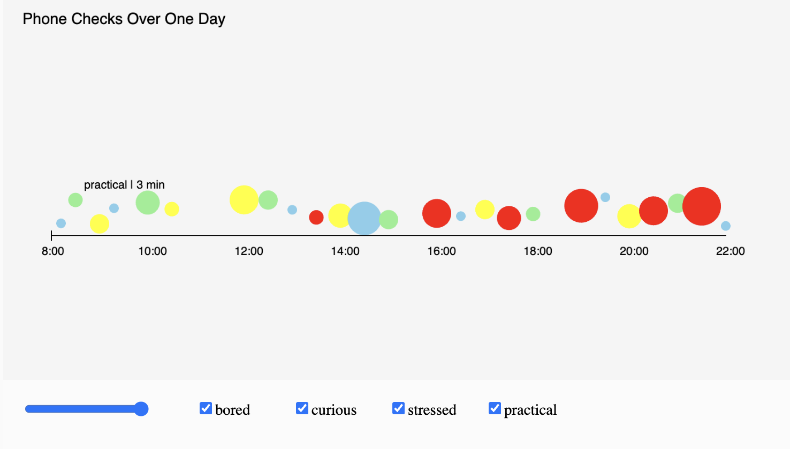

# Week 02

[← Back to Home](../index.md)

Week 2

# In Class Experiment

## Part 1
In week 2’s class I was sick so I didn’t complete the task with other people and instead did it at home by myself following alongside the lecture recording. I started out by playing around with p5. In highschool I took computer science throughout level 1 to scholarship, so I felt quite confident – even though we never went over javascript fully, so alongside the tutorials that p5 has I was able to move through it decently quickly. After playing around I followed the lecture and was able to create the image shown below using the following code. 

## Part 2 
Afterwards I began moving on towards part two of the in class activity which was creating an interactive sketch, following the guides and with the lecture recording, I then created a very similar sketch to the first one but make a landscape and has a slider to change the colour of the sun, I initially used the random feature to change the colour of the sun when pressing a button, but then I realised that the experiment asked for two different interactive elements, so I had to change up my sketch. I then decided to make it so that the user could input what colour they wanted to change the sun to. I did this by making using let, and making the sunColour a function and setting it to yellow initially, then I created an sign with some brown rectangles then created a input which the user could then use to enter in what colour they wanted the sun to be. Then I added a button under the input and once the button was pressed it would take the input then change sunColour to whatever was inputted. This was pretty interesting to make as working with as it felt really similar to working with python in my opinion, and at first I thought that p5 was python so I would try to do something as if I was using python and it wouldn’t work and I would be really confused, but eventually I finished it.  

 
## Part 3
Then I began working on part 3 which was vibe coding and using AI to assist in the coding, while working on the second part of the in class experiment I noticed how the sun when yellow kind of looked like a nuke exploding in the horizon so I started working on that. I tried to add a button to create an animation of a rectangle nuke dropping then turning into a explosion. I started this by adding the button, then I wasn’t entirely sure how to do the rest so I asked ChatGPT how to go about this, and it told me to make a rectangle and change its position to create the effect of the nuke dropping then once its reached the canter then to add a circle and expand its size slowly, all of which we covered in the earlier experiments. I had a bit of trouble with the code to get the nuke to change positions so I asked ChatGPT to give me some code, and while I was there I also asked it to move the second sign with the nuke button to the center and remove the original sign with the sun colour change. 

It gave me a really nice code but it forgot to remove the input from the first sign so I manually found the area in the code for it and removed it.  That turned out really nicely but I did notice that the nuke button was still there even after the nuke exploded so I asked ChatGPT about that and it gave me a line of code to remove the nuke button after the explosion happened and then it turned out really nicely. 

# Independent Study 2 
For our second independent study we had to transfer the data we collected from the first independent study and then moved it into P5 to create a sketch, I did this by using a similar data sketch as the one that the other group had done for week 1’s in class experiment. I decided to just add a timeline, with each ball to showcase when I was distracted by my phone, with different colours representing my different reasons why I needed my phone, and the size for how long. I also just want to note that my data had too many points to show on a tiny canvas so I decided to randomly select 25 data points, this was done with a random number generator to pick out from my data. I did this via a online number generator that way I would limit as much human bias as possible from me, as I know that if I were to randomly choose it wouldn’t be completely random as I would have unintentional bias, hence I chose to do it via computer. With the data selected I then added it to the code, and then assigned colours based on what I was feeling. 
-	Bored = Sky blue
-	Curious = Yellow
-	Stressed = Red
-	Practical = Green

Afterwards I saw that we needed to make it interactive, I thought that the best way to do this would be by adding a toggle to hide the various different emotions, as well to add a slider so I could more accurately see what time of the day each for this I asked ChatGPT for help as I was a bit stumped on how to actually get them to disappear. The way it works is that before drawing all of the circles its checks to see if the mood is on, and if not it will skip over all of the data points with that specific mood when drawing the circles. The slider works in a very similar way except that it uses the time instead of the mood, and if the time is higher than the slider then it won’t draw the circle.  

Then I during class I got some feedback, and they said that it was kinda hard to see the specific data from each of the circles, so I came up with the idea to allow you to click on each of the circles to see their specific data, I didn’t really know how to do that either so once again I asked ChatGPT. It then gave me code that made it so when hovering over the circles it showed the various information. 

## AI Usage Statement

*Document any use of AI tools under an AI Usage Statement heading. Explain which tools you used and describe how you used them. Reference any AI-generated content (see [QuickCite](https://auckland.libguides.com/referencing-generative-ai-tools) for guidance).*
