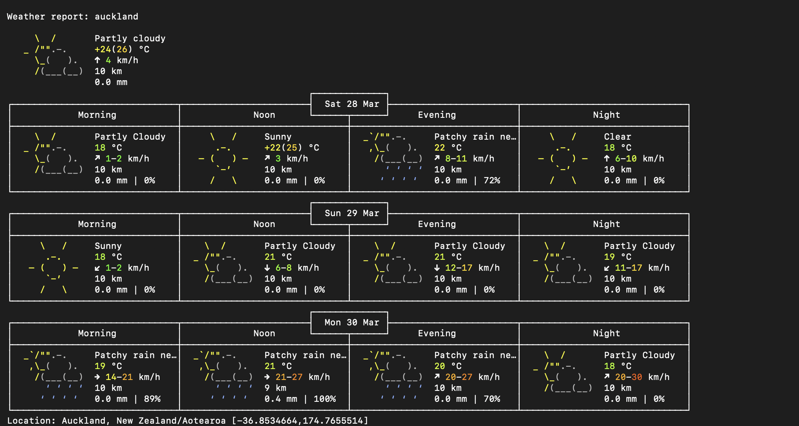
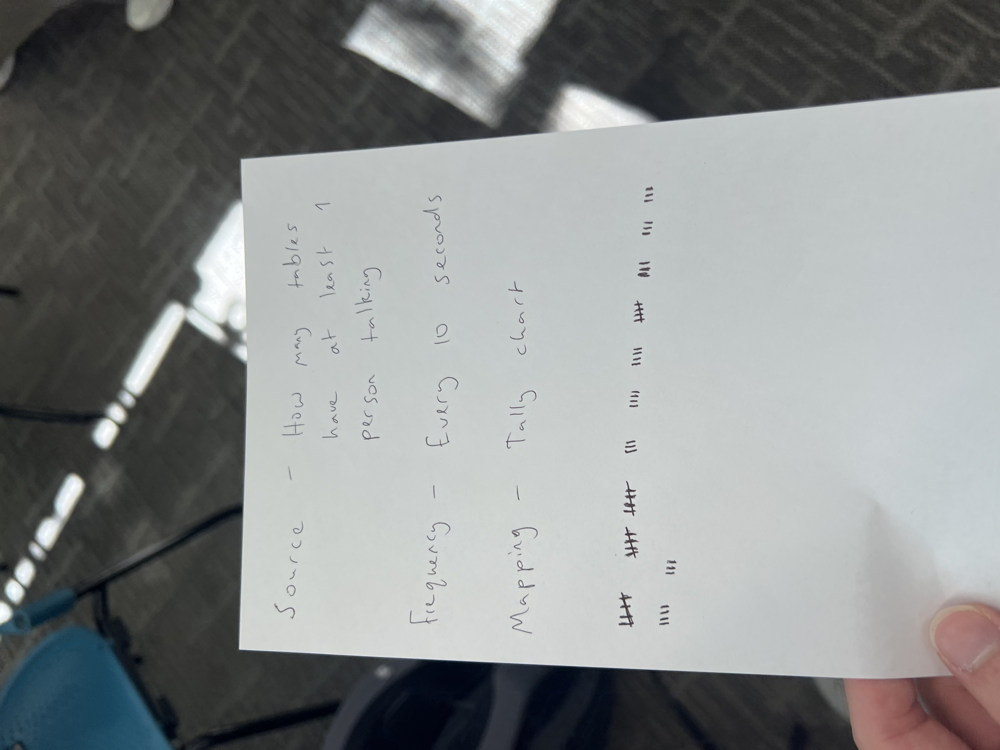
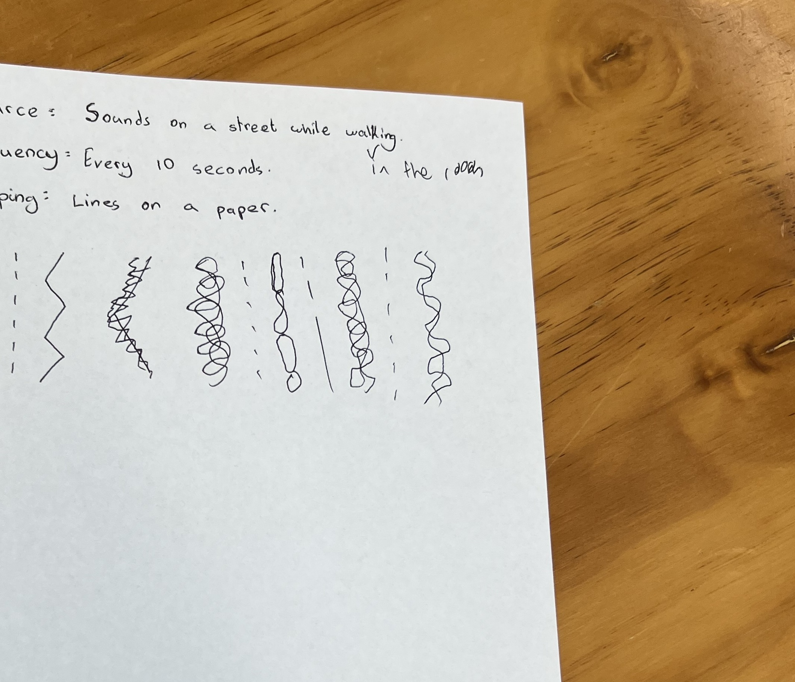

# Week 03

[← Back to Home](../index.md)

# In Class Experiment 
During class in week three we did Live Data collection, we started out by watching a video about a man on the train using a pen and paper to collect the data of the movement of the train. I think this video was really memorable to me as I never really thought about collecting data in this way, this was really different as instead of actively asking questions or actively listening or thinking, he passively just waited and let the movement of the train move him and collected data via that. After watching that video we then begun the actual in class experiments, we first started by going into our terminals and playing around. On my MacBook I first started out by playing around with some commands such as pwd – which got the computer to show which directory im current in, ls – asking the computer what’s in the directory, cd ____ - which if asking for a folder, would take you into a folder,  and finally cd .. – which would go back. This was pretty could as I’ve seen the terminal a lot in my life whether which downloading Minecraft mods, or playing video games, but I’ve never actually known what it did, and being able to experiment with it was really cool. 

## Curl
After that we learnt about curl which is an open source command line tool which can be used for transferring data over the internet. We first started by copy and pasting 

-   curl ascii.live/forrest

into our command terminal which showcased a running man in our terminal. It was pretty cool to see this play out in our terminal as it was something that we can do offline. 

After that we then tried using 
-   curl wttr.in

This actually didn’t work in class for some reason, but after the class I went home and on my home Wi-Fi it did work, and it generated a full weather report for the next three days, which again was pretty cool to see as it gave all the information needed in a well formatted way without too much clutter. Also it was pretty cool once again that it was all just taken from my computer and curl. We also then tried to filter the data which was done with the following command lines. 

-   curl "wttr.in/Auckland?format=3"
-   curl "wttr.in/Auckland?format=4"
-   curl "wttr.in/Auckland?format=%l:+%t+%c"
-   curl "wttr.in/Auckland?format=%l:+%t+%h+%w"

The following codes and the meaning

-   %l – Location
-   %t – Temperature
-   %c – Weather Condition (Displayed as an emoji)
-   %h – Humidity 
-   %w – Wind 
-   %s – Sunrise
-   %u – UV Index – 1-12 

This was pretty interesting, I think that It was pretty cool how the simple codes could also be added together, again it was pretty cool to see that all of this was achievable through just the command terminal in my computer. After that we then used curl to look up words via the dictionary using the command line.

-   curl https://api.dictionaryapi.dev/api/v2/entries/en/design

This generated a large box of text, which was kind of hard to understand, but it seemed to generate everything from the definition, to the phonetics, and synonyms of the word. The reason why it generated such a large box of text that was slightly hard to read was because to gave us the whole Json format, which is normally used on the web, so when transferred on our terminals it looked a bit weird. 

## Weather Visualisation 
After experimenting with curl in the terminal, we then moved onto visualising the weather, this was done in p5 once again, alongside an API – a structured way for programs to communicate and exchange data. The sketch we opened in p5 was using The Open Meteo API which gathered the data from Auckland allowing us to map its properties, such as the humidity of the air changing the background colour of the canvas, the red rectangle in the corner as the wind speed, and the size of the circle as the temperature times by ten. I thought this was really cool way to display the data with images, I know this course is all about finding ways to display data that is different and unique. I find that even halfway into the semester this course still gets me thinking in ways that I wouldn’t have thought about in the past and visualising data and ideas as a whole in new and creative ways that pre semester me never would’ve even considered.

## Live Data Protocols
For the final bit in class, we got into pairs – or in my case a group of three, and then created a data protocol - which is a set of rules for gathering live data. For our protocol we had to specify three things.

-   Source: what live data to observe (e.g. sounds in the room, a live transport tracker on your phone)
-   Frequency: how often to check (e.g. every 10 seconds, every minute)
-   Mapping: how to record each observation as a mark, shape, or action

My group came up with the following:

-   Source:  How many tables has atleast one person talking
-   Frequency: Every 10 Seconds
-   Mapping: Tally 

Then afterwards we swapped with another group and their protocol had the following:

-   Source: Sounds on a street while walking 
-   Frequency: Every 10 Seconds
-   Mapping: Lines on a paper

Now unfortunately for us the group we got paired with didn’t follow the instructions properly as we were told to create a protocol for data we can collect in the classroom, so we updated their source to be, sounds we can hear in the classroom. We were sort of confused by the mapping, as it was kind of vague, what we ended up with was, we would draw the lines shape based on how the sound felt/sounded like, e.g. loud sudden sound, sharp zigzag big line. The way we timed the frequency was by using a stopwatch on someone’s phone that way we could accurately measure the frequency.

After that we compared with the other group, and they followed our protocol to a t and basically did it the way we intended with a tally for how many voices they heard. For them we told them we had to change it and they realised once we begun that theirs probably didn’t work. They did like how captured the data as it was about the same as what they intended for the mapping, which was good as that meant that the rest of their protocol was good and clear.

# Independent Study 
For this independent study, I created a p5.js sketch that showcases the sun’s position over New Zealand during the day. The sketch combines a simplified map of the North and South Islands with a dynamic sun that moves according to real-world sunrise and sunset times for Auckland. To make the sketch, I first drew New Zealand using simple circles, while I got the basics working, I wasn’t really too concerned about how they looked to begin with as I wanted to make sure that the Api would actually work first. I then connected to the Sunrise-Sunset API to retrieve the day’s sunrise and sunset times. These times were mapped to the sun’s horizontal movement across the canvas, to be honest I did have to get some help from ChatGPT to actually visualise it properly, but eventually I was able to make it slowly go across the canvas. I really like how the sun is visualised by the transparent circle, and it works a lot better than just the numbers of the suns position/time of sunrise and sunset. 

After getting it to work I then wanted to make New Zealand a bit more accurate so I got some help from ChatGpt just to streamline the process a bit. It gave me a decent looking New Zealand, but I did have to change a few of the prompts, to make it more accurate; alongside changing some of the proportions manually.  Afterwards I got this final sketch.
 

I think this was fun to create, it was similar to what we did in class with the use of the weather Api as well as the ISS Api. However I also think that this week’s independent study could’ve been done better, I think that it was completed to a high standard but I also feel that I’ve been relying on AI a bit in week 2 and a decent amount in week 3, I know going forwards I should try and rely less on AI as while I’ve reflected on this week’s experiments I think that as soon as I got stuck I went straight to asking AI what to do, instead of thinking for myself. I know that this is definitely hindering my creative processes, however I think it is good that I’m noticing this and also being mindful of it as I also know that looking at the course schedule, week 4 is going to focus on AI. 
