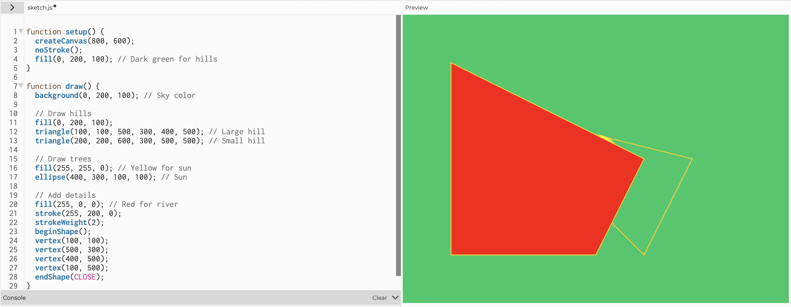
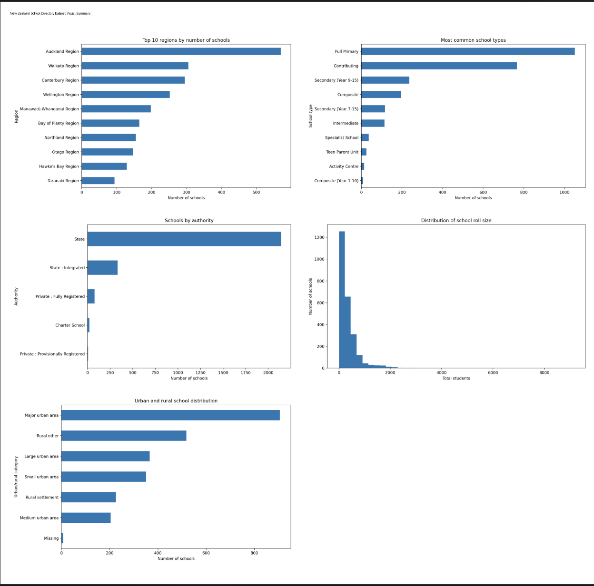
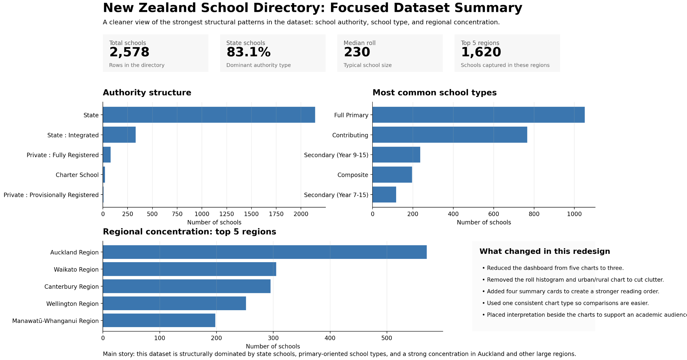
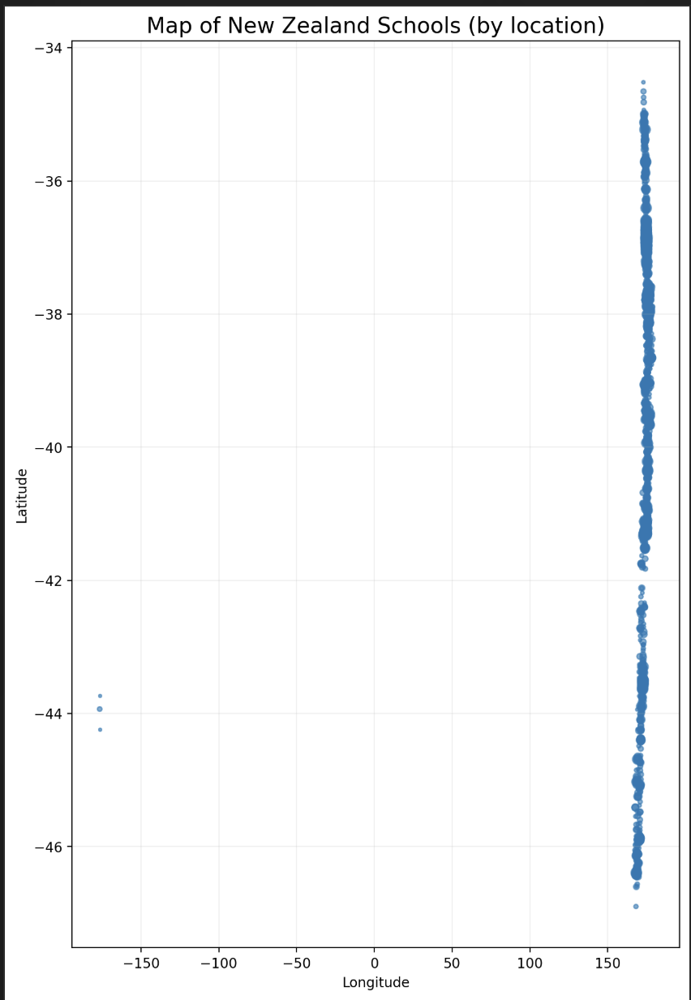
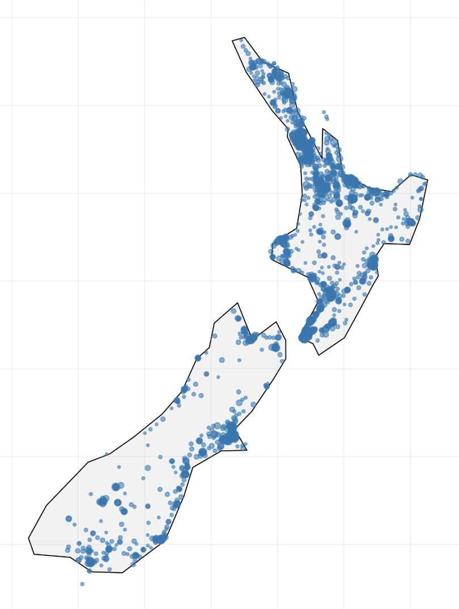
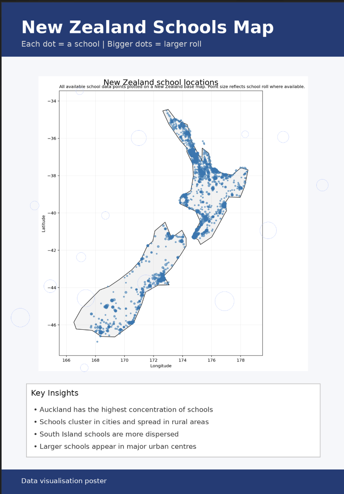
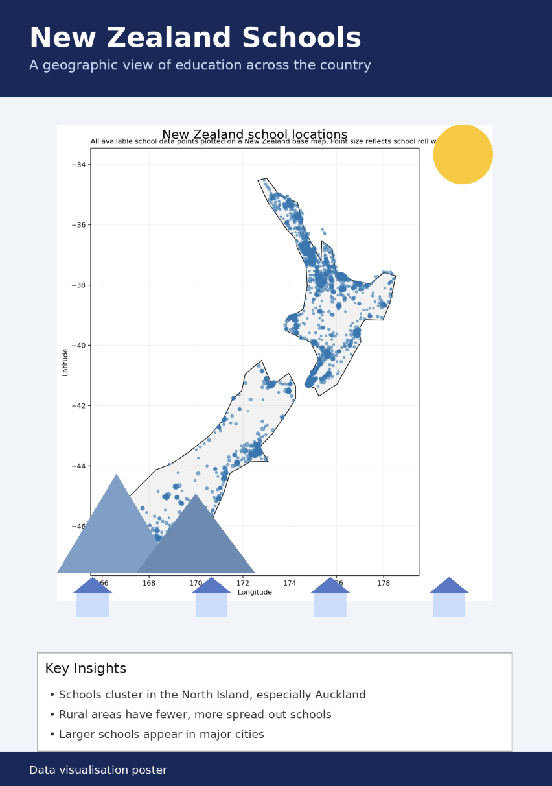

# Week 04

[← Back to Home](../index.md)

# In Class Discussions
Like I assumed last week, week fours class started with a discussion on AI, we talked about ideas such as how AI might change the future of design, the ethics around it, as well as the sovereignty of AI. Personally I know that AI is going to be a big part of design in the future – as it already is a heavy part of it now, even the university of Auckland has begun teaching the use of AI in our core second year courses. I think that designers should not stay away from AI as a whole, as in our first year we were taught that designers need to keep an open mind and be open to adaptability, and if we were to keep a closed mindset towards AI it just wouldn’t be helpful to us as Designers. I think that AI is alright to use as long as it does not replace your entire Design Process, I think that AI is very helpful to streamline some repetitive processes when designing. Personally I do use Ai features that come with apps such as Figma, photoshop, and premier pro as I find them very useful to help me do things in a matter of seconds that would normally take me a few hours, some notable examples would be the the rotoscoping in Premier Pro, as well as the ai fill in photoshop – these allowing me to streamline simple but long processes to a matter of seconds.

## Ollama
After our talk about AI we then moved on to experimenting with Ollama it was an AI chatbot that was entirely in our terminals. I think this was really cool as it was very similar to ChatGPT and other Ai chatbots I’ve used before, but it was also different as you could see how it was thinking and the way it came upon ideas. Although it did feel slower than other AI chatbots you’d find on the internet I did find it cool how it was just on my terminal once again, and it did seem that the quality was very poor compared to some of the free models you’d find online. I asked it to generate me some code for a landscape in p5, and although it did give me some code, the outcome of the image just wasn’t good.

 Since a lot of the class had problems with getting their Ollama downloaded we quickly moved to the second part of the in class experiment. 

## NotebookLM
After Ollama we then went to an website called NotebookLM, we started out by adding some sources to the website, some of the things I included was my making journal, a previous website that I’d worked on, as well as an article from high school that was slightly related to the website. Then we were told to add a new text file called context.md and in it add three sentences

-	The experiment you found most interesting and why
-	A theme or idea you keep coming back to
-	Something you're curious about but haven't had a chance to explore yet.

I tried this but some reasons it wouldn’t accept my file so I just decided to entire the information manually and was told that it would work like that too. So I entered the following information 

-	I found most interesting was the second one, creating a data visualisation on p5.
-	A theme I keep coming back to the use of technology within my designs, and my overreliance of it sometimes
-	Something that I’m curious about is motion design

After that we were tasked to ask it the following questions

-	"If my sources were documentation for a design project, what would the final outcome be?"
-	"What do my sources suggest I care about?"
-	"Identify a provocation hidden in my sources"
-	"What would someone who disagrees with the ideas in my sources argue?"
-	"Which of my sources are you drawing on for that, and which are you ignoring?"

And it came up with the following responses:
-	My Final Outcome would be an interactive data-driven digital platform – most likely a website or app. 
-	Based on the sources it would suggest that I cared about things such as technical design innovation, and dedicated community service. As well it suggested that I had care for UX/UI design, technical skill mastery, and creative experimentation
-	 One hidden provocation that it found was the tenison between the technical automation of design, and the deeply human nature of humanitarian service. 
-	Something that it said it would argue is institutionalization of altruism and the technical reduction of human connection. Making points such as Technical Reductionism Vs Human Integrity, and the Ethics of using Service as a “Design Playground”
-	It seemed to focus a lot more on my sources for my service awards, Charity website pages, and making journal, and it ignored other names on the service awards lists, as well as bank details to donate on the charity website.

Afterwards we were also tasked to generate an audio overview and give it a listen to. The thing that I found the most surprising element was how the overview managed to bridged the gap between my past in high school getting my service colours and my current identity as a design student at university. Hearing the hosts connect the "outstanding contributions" mentioned in the school news – such as volunteering at local hospitals or foodbank, to my technical goals in DES240 was a perspective I hadn't fully articulated myself. It highlighted that my interest in UX/UI design isn't just a career path, but a continuation of the integrity and passion noted by Sir David Moxon in the Solomon Islands Medical Mission website.
### What it Got Wrong
The overview occasionally struggled with the noting the difference between the $88,000 raised by the school community and my specific making journal. It seemed to imply that the money my high school helped raised were a direct result of the data representation experiments I’m currently doing at uni, even though the sources I added suggest the fundraising is an established annual effort by my school community. Additionally, while it correctly identified my "growing passion for motion design," it overestimated how much of that has been integrated into the SIMMNZ project so far, given that I have only just recently started learning about it and how to use After Affects.

# Individual Experiment 
For this weeks individual experiment, we were tasked with getting a csv database from catalogue.data.govt.nz and then enter it into an AI chatbot, so I got a database about all the schools in New Zealand and put it into ChatGPT. I asked ChatGPT questions such as 

-	What could you tell me about this data 
-	Is there anything that is missing from this data that could be useful for making inferences and that could be helpful overall
-	Do you know when this data was taken
-	Would you say there is any bias to consider in this dataset
-	Can you visualise this data for me via a graph

The AI told me about how the dataset contains a data on every school in New Zealand, with a row of 2,578, and 50 different coloumns, with information such as 

-	School Ids
-	School Name
-	Status
-	Location Data
-	Type
-	Structure
-	Roll 
-	Authority 
-	And more

The AI gave me a clear indication on what I was able to find with this data, but it also indicated how there was some crucial data that would be important for answering questions and making inferences. Some of this data included things such

-	Student outcomes (NCEA, literacy, numeracy, ect) 
-	Teaching Staff Data 
-	Funding
-	Trends

ChatGPT told me that thing data would be very useful as with the current data you can describe the schools in New Zealand, but you wouldn’t be able to judge their performances, and if any schools needed extra help compared to other schools. As well ChatGPT brought up an interesting point that the dataset is only a snapshot of trends, and not a full history, so that made me wonder when this dataset was actually taken. I asked ChatGPT about it and it indicated that based on what it could tell it was recent and that dataset was actually created as I downloaded it, which makes me believe that either the catalogue data website was updated live, or the dataset was taken very recently such early 2026, as it indicated there were schools that been opened starting 2026.  Afterwards I asked it if there were any bias to consider within this dataset, and it gave me some interesting points. 

I think the first one was that the data was purely administrative, and there was no data from lived in experience from the schools, so even though a school may look good on paper, but if you were to ask students the school may be performing poorly, which is another reason why filling in the gaps in data such as the students’ academic results would be useful. Another thing that it brought up again was the fact that the data was only a snapshot and not a full history, which would hide things such as if the school was growing or shrinking in roll, or if there was temporary issues with the school it would be frozen in that point of time. 
Afterwards I asked ChatGPT to generate me a photo of the data for me to evaluate it first gave me this photo:

This first image was okay, it seemed really cluttered, and honestly it was quite hard to get information of it, or make any key critical evaluations from the data. So I asked it to remove a few of the more useless graphs, as well to make the data more clear so you could evaluate it and make assumptions and overall just a easier way to read it. This is the result of that next prompt 	

 

This second data set visualisation was very nice as it was so much more clearer, only having three different graphs, as well at the top it gave me some nice clear important information such as the median school roll, and total schools. Another key feature in this visualisation is that its more laid out like you would find in academic worksheets or papers, which I find much more useful as someone who studied Statistics in the past. After evaluating this visualisation I then asked ChatGPT to give me a third one but I wanted this one to be even more different from the first two, more specifically a map of New Zealand with all the schools. With the outcome being:

Obviously this map didn’t work from ChatGPT so I attempted two more times refining it with each prompt getting more and more refined, trying to slowly explain to ChatGPT that there was no New Zealand, and the datapoints weren’t actually showing up, but no luck. Eventually I told ChatGPT to completely ignore the previous questions and just to generate a map of New Zealand with all the datapoints, and that actually somehow worked, below is what it generated  

With that being generated I decided to move on to something slightly different, I asked ChatGPT to generate me a infographic poster, and the first generation was just the map photo with a title, and that was about it, so I asked it to generate me a graphical poster, with images and cool text. It kept giving me basically the same thing with just the map and then some text, which was good but it really wasn’t what I was after. 

## Critical Evaluation
I think AI has immense potential to the future of design, it has the possibilities to streamline design processes, and be used as a tool to make our lives as designers so much easier, without fully replacing us and our work. However I do also believe at its current stage AI is not sustainable enough to work out in the long run, issues with cost to run via hardware, as well as the wastage of water, which goes against our UoA design kawa of kaitiakitanga. As well the ethical concerns are a big factor that we had to consider during our DES200 course. During this weeks work we got to learn and think about about all of this via our experimentation with AI. 

I found that in the case of ChatGPT often when asked for something you would have to either ask multiple times, or refine your prompt a few times before getting a result that you were even slightly happy with. I noticed that for the first generation of the visual generations it defaulted to a graph, which makes sense as the default way I would visualise data like that. Comparing results with friends in the class it seemed that ChatGPT would default to graphs for most people when just asked to visualise this data. It also seemed that I had to correct and had to redirect it in the direction I wanted to, i.e asking for less graphs to make it legible and useable, also during my creation of a map visual graph, it seemed to not be able to work out how to do it until I had it start over from scratch which was really strange and annoying. 

One interesting thing I noted when generating the third data visual – the poster, was the fact that he kept thinking that the poster was for an assignment, which is why it kept generating me educational posters – when I was going more so for looks than data. I think the reason why it did this is because of my history with ChatGPT, it knows that I am a uni student and it knows that I often use it to help me with assignments. It also makes me consider any bias it made when it gave me my previous outputs and if they were at all influenced via my history. With that in mind I do wonder what would happen if I were to try this experiment again either on a new account, or not logged in at all. 

I think that the map visual was probably the most interesting to work with as it really opened my eyes to the limits that ChatGPT has, and how often times it wont get it right straight away a lot of times, it really got me to consider if anything else in the past was wrong, and I haven’t been thinking critically enough to consider that it was wrong. I now really think that ChatGPT at most is simple tool, I don’t think it should be relied upon heavily for more complex design operations, such as for graphic design, or even for designing with data.  

I think that if I were to do this independent study without AI it would’ve taken me a lot longer, but I think that the outputs would’ve been more refined with its data representation and looked a look better overall. I think that’s the overall consensus that I’ve come up with Ai, Its very useful at the start of the design process, but lacks depth later on. I think that an example would be the map visual, it took a long time to get AI to generate that image but if I were to do it without AI, I probably wouldn’t have tried to do that map, and instead I probably would’ve used another tool such as NZ Grapher to give me some visualisations of that data. 

