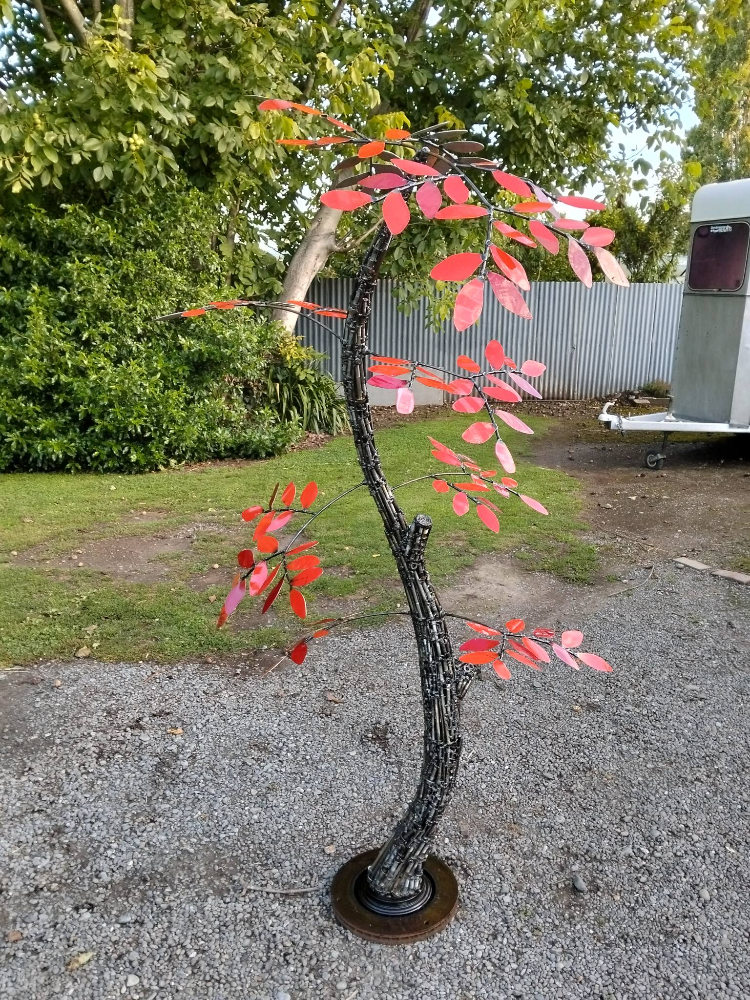
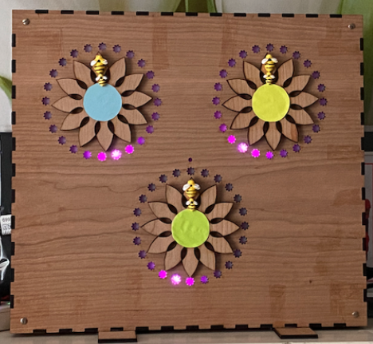
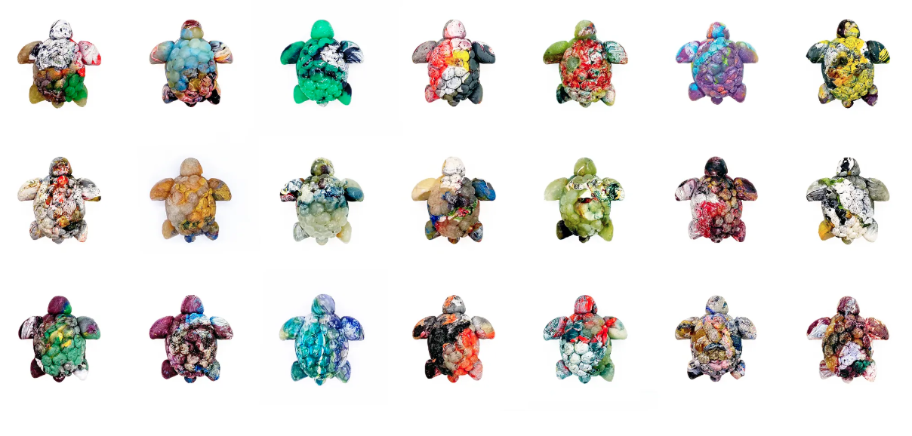
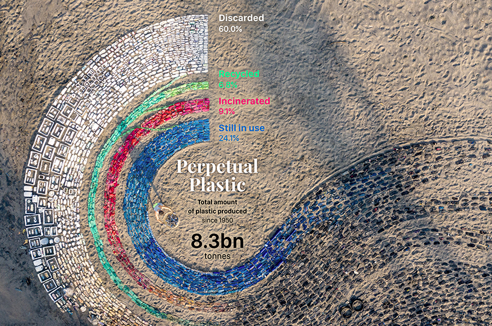
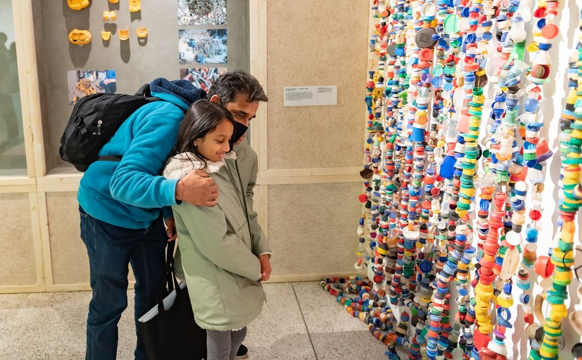
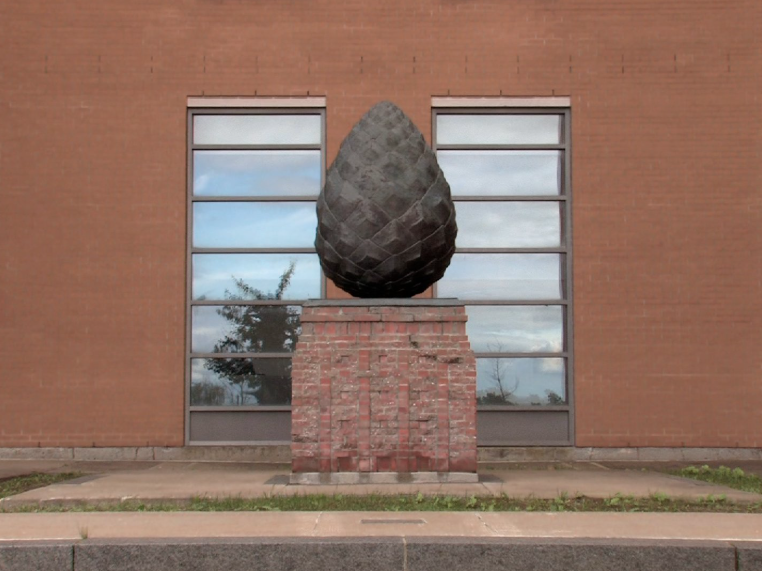

# Week 06

[← Back to Home](../index.md)

## Data Exploration

My data will come from myself. I want to track my bank statements and record every transaction I make during the month of May. This will include spending on things such as food, rent, clothes, transport, and other personal purchases. I will track every purchase in a spreadsheet, order the transactions from highest to lowest, and record what each item was.

There is definitely some personal bias within this dataset because I am collecting it myself. This data would look very different for someone else. For example, someone who lives at home with their parents may not have to pay for rent or food, while I am flatting and have those costs. This means my data will not represent everyone’s spending, but it will still show my own habits and patterns.

This is important to keep in mind while creating my final artefact. I may add a short message in the project statement explaining that the work is based on my own spending and should be viewed as a personal reflection rather than a universal result.

## Visual Research 

  
*Image taken from Facebook: https://www.facebook.com/groups/845171258848707/posts/26748779004727911/*  

This tree sculpture stood out to me because I initially thought it was a real tree before looking closer. As mentioned in my proposal, I want to create my sculpture out of recycled materials as a commentary on the overuse of AI that many designers have come to rely on. Seeing this sculpture reinforced my desire to use recycled materials to create this artefact, which I have named **Hesperides**.

  
*Image taken from: Eco-Garden data sculpture, https://visforclimateaction.github.io/papers/1018-doc.pdf*

This project is useful for my own work because it shows how data can become a physical object instead of staying as a graph or screen-based visualisation. I like how the garden form makes the data feel more personal and less cold. This connects to my idea because I want my spending data to become part of a tree-like sculpture, where the shape and materials carry meaning. It also helped me think about how my artefact could make people reflect on everyday habits, such as spending, waste, and consumption.

  
*Image taken from: My Plastic Footprint, https://medium.com/nightingale/my-plastic-footprint-a-physical-data-visualisation-project-6a35eec32845*

This project tracks personal plastic use and turns it into a physical data visualisation. I found this relevant because it uses data from everyday life, similar to how I am using my own spending data. It shows that personal data can still have wider meaning when it connects to bigger issues like waste, sustainability, and consumer behaviour. This made me think about how my own purchases could represent more than just money spent. They could also show patterns of need, habit, impulse, and waste.

  
*Image taken from: Perpetual Plastic, https://www.designboom.com/art/perpetual-plastic-data-sculpture-4760-pieces-of-trash-08-09-2021/*

This data sculpture uses collected pieces of plastic waste to create a strong visual and physical impact. I found this useful because the material itself becomes part of the message. This links to my plan to use recycled cardboard and paper instead of buying new materials. I want the sculpture to feel handmade and imperfect because that contrasts with the clean, polished look of AI-generated design. This reference helped me think about how rough materials can still create a strong visual outcome.

  
*Image reference: Waste Age: What Can Design Do?, https://designmuseum.org/exhibitions/waste-age-what-can-design-do*

This reference helped me think more about the environmental side of my project. The exhibition looks at how design can respond to waste and overconsumption. This connects to my project because I am not only visualising spending, but also questioning the systems behind spending and production. My use of recycled materials can help show that the project is not just about personal finance, but also about the waste created by consumer culture and technology.

  
*Image taken from: Le Jardin des Hespérides, https://artpublicmontreal.ca/&oelig;uvre/le-jardin-des-hesperides/*

This reference connects to the name of my project, **Hesperides**. In Greek mythology, the Garden of the Hesperides is linked to a tree with golden apples. I chose this name because my project is about value, temptation, and consumption. The “golden apples” can represent the things I spend money on, while the tree becomes a way to show how spending grows over time. This helped me think about using the tree not just as a shape, but as a symbol for desire, money, and the things people reach for.

## Project Planning

The first priority is figuring out how I am going to create the sculpture. The main idea I am thinking of right now is using recycled cardboard for the main structure, then adding paper and paper mache over the cardboard. This means my first priority is learning how to use paper mache properly and testing whether it will be strong enough for the final artefact.

The sculpture will most likely take the form of a tree. This links to the name **Hesperides**, which references the mythological garden and the idea of valuable fruit. In my project, the “fruit” or “leaves” of the tree could represent my spending. Each part of the tree could show a different category, such as food, rent, clothes, transport, or personal items.

I also want the materials to support the message of the work. Since the project comments on spending, consumption, sustainability, and the overuse of AI, recycled materials feel like the right choice. Instead of using AI to make a polished digital visualisation, I want the final artefact to feel handmade, physical, and imperfect. This makes the work feel more human and personal.

Moving forward, the next thing I need to do is start recording my spending. I will most likely record each transaction in my notes app as soon as I spend money, then move the data into a spreadsheet later. In the spreadsheet, I will organise the data by date, item, cost, and category. This will help me see what I spend the most money on and how I could turn that data into a physical form.

After that, I need to do more research into how to make the sculpture. I will need to learn how to create a stable base, how to shape cardboard into a tree structure, how to apply paper mache, and how to attach the data pieces to the sculpture. I may also need to test different materials before deciding on the final method.

At this stage, my idea is that each fruit or leaf will represent one purchase. The size of the fruit will show the cost of the purchase, while the branch or placement may show the spending category. This system may change as I test the form, but it gives me a starting point for turning my spreadsheet data into a physical object.

## Independent Study

For my independent study this week, I focused on thinking through how my data and final artefact could connect more clearly. At first, I knew that I wanted to track my spending and create a sculpture, but I had not fully decided how the data would appear in the final work. After looking at visual research, I started to think more about using the tree form as a way to show different types of spending.

One possible idea is to make each branch represent a spending category. For example, one branch could represent food, another could represent rent, and another could represent clothes or personal spending. The size or number of leaves on each branch could show how much money was spent in that category. This would allow the viewer to understand the data through the shape of the tree.

Another idea is to use hanging tags or fruit-like shapes to represent individual purchases. Larger purchases could be shown through larger pieces, while smaller purchases could be shown through smaller pieces. This would make the spending data more visual and physical. It would also connect well to the name **Hesperides**, as the tree could hold objects that represent value, cost, and consumption.

I also researched and thought about paper mache as a possible method. Paper mache could work well because it uses paper, glue, and water, which makes it accessible and low-cost. It also creates a handmade texture that fits the message of my project. However, I will need to test it first because it may take time to dry, and it may not be strong enough unless the cardboard structure underneath is stable.

A key part of my independent study was thinking about the role of AI in my project. I do not want the final work to feel like something fully generated or controlled by AI. Instead, I want to use the project as a small commentary on how design can lose its human touch when people rely too heavily on digital tools. By using my own spending data and recycled materials, the artefact becomes more personal and physical.

Another part of my independent study was drawing a concept sketch, which can be seen in my Week 7 making journal page. This sketch helped me start planning the physical form of the tree and gave me something to share with the class for feedback.

## Consultation Reflection

During my consultation, we talked about my thematic focus, my data sources, my visualisation, and the impact of my work. The impact question caught me off guard the most because I had only considered it briefly before the consultation. I knew that I wanted the work to make viewers think about spending, while also linking to AI usage and sustainability, but I had not fully explained how these ideas would connect.

After the consultation, I realised that I need to make the message of the project clearer. The work is not just about tracking money. It is also about reflecting on personal habits, consumption, and the value of handmade design. My spending data shows how money is used in daily life, while the recycled sculpture shows the physical waste and materials that can come from consumption.

The consultation also helped me think about the audience. I want viewers to question their own spending and think about how often they consume without noticing. I also want them to think about the role of AI in creative work. While AI can be useful, there is still value in making something by hand and using physical materials to communicate an idea.

Moving forward, I need to focus on making the link between the data and the artefact stronger. I will do this by making sure that each part of the sculpture clearly represents something from my spreadsheet. I also need to keep recording my spending consistently so that the final data is accurate enough to use.

## AI Usage Statement

The only thing I used AI for this week was asking it to suggest project links that could fit my proposal or be useful for my visual research. I used these suggestions as a starting point, then selected the references that felt most relevant to my project.