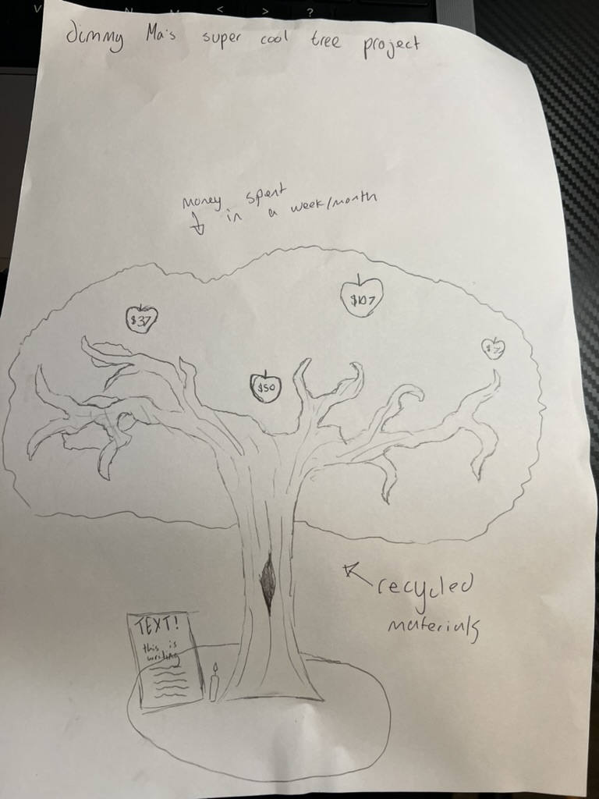
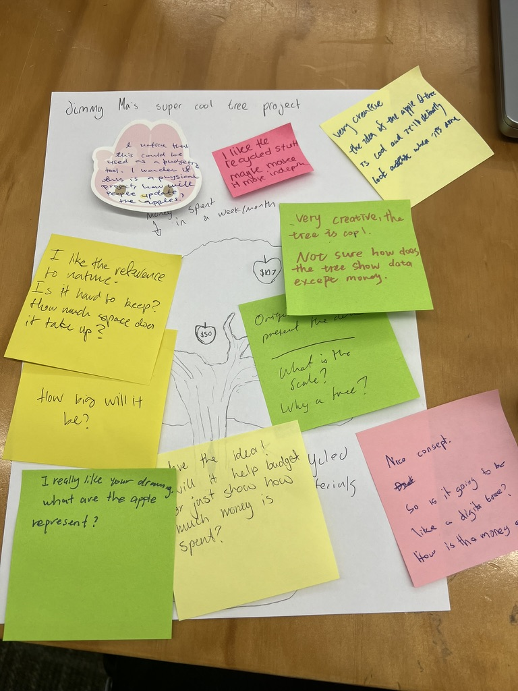
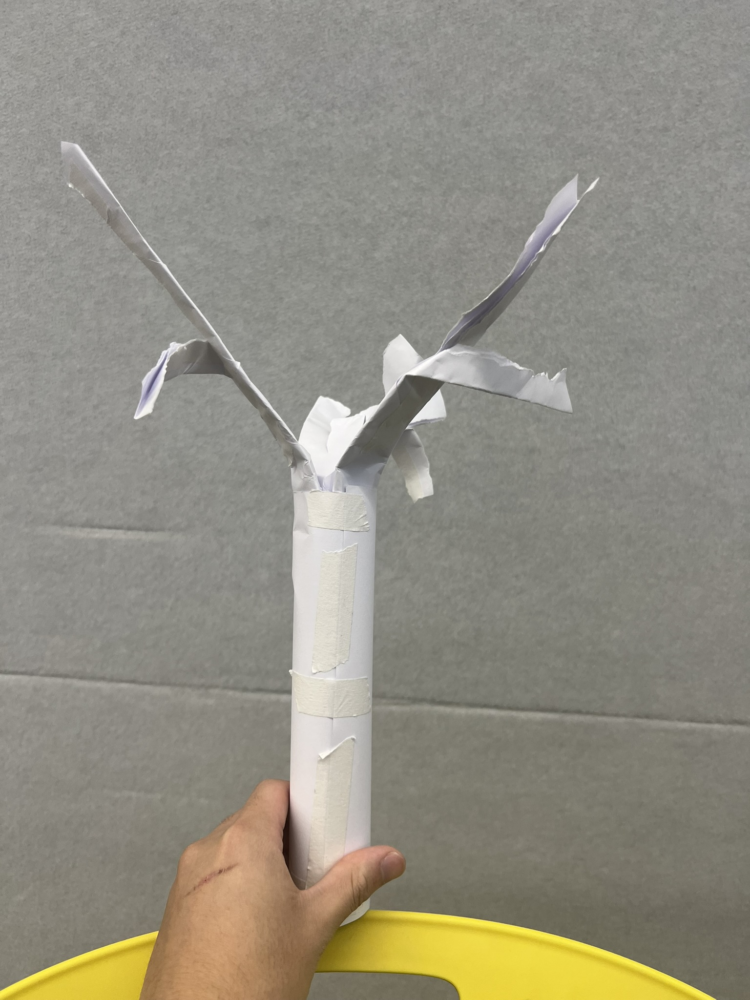
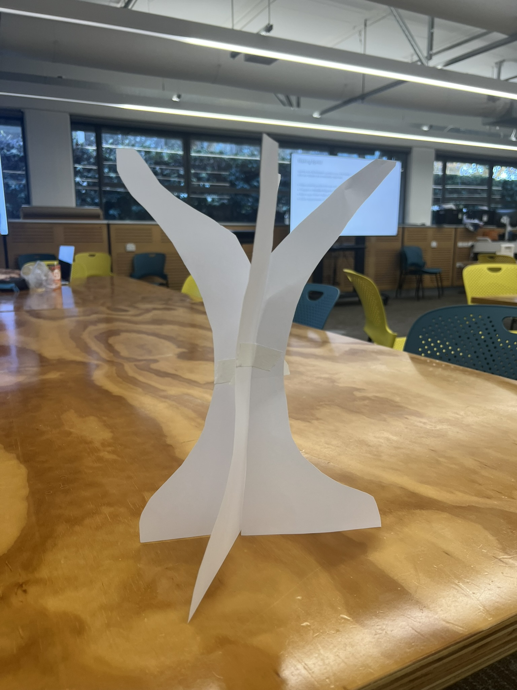
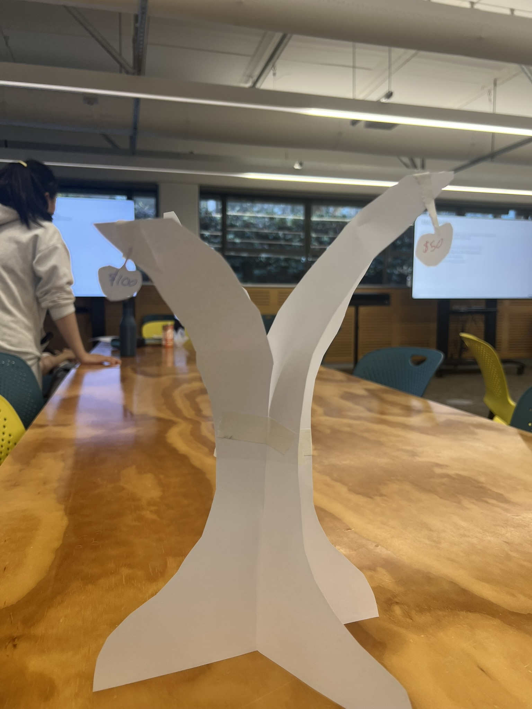

# Week 07

[← Back to Home](../index.md)

## Concept Sketches 

*Image of my concept sketch from week 6*'

This was my sketch that I made during week 6, it followed my idea with a tree made from recylced materials and fruit which would display the amount of money spent within the month of May. I think that it would sit on a mount of grass and in the grass would have a stone or sign which would house the Project statement. 

After getting to class we then left our sketches on the table, and walked around the class with sticky notes, giving comments, questions, and advice to each other. After looking around, giving feedback, and understanding the ideas made from my classmates, I headed back to my table to see the comments left on my work.

*Concept Sketch with feedback*'

I think one thing that I noticed from feedback was that people were really intrigued by my idea, as they found both the idea and the excecution quite creative; I found that most of the other students in the class we doing more projects on P5js rather than something more physical which was interesting to note. Another thing that I noticed that some people might've been confused by how the data was going to displayed, so I think that means I will have to either make it more clear in my physicalisation or I can explain it in my project statement. Another note that was left was asking about the scale of my project, this was something that I hadn't considered yet, and I think this will be something I need to decide soon, but maybe for the branches around 60cm tall. 

## Making Sprints

*Paper Prototype V1*'
This was the first thinkg I made during the making sprint, I was kind of expirimenting with how the tree was going to look here as aside from drawings which can be hard to perfectly replicate, I had not yet decided how it was going to actually look like. I think that this first paper prototype is just that, a paper prototype; I think that this one looked really bad but it did give me an idea of what I didn't want my design to look like. I think as well this one just didn't really have a way for me to hang the fruits on it.

*Paper Prototype V2 - No Fruit*'

During the making sprint I made a few paper prototypes just to gage how my design would function and how I would make it. Above is the second iteration and this one I tested how I would join the base together by cutting a line down the center of the trunk and connecting two of them together to create a 3D looking tree trunk. I really liked this idea as it gave me a functional goal that I could actually recreate with on a larger scale, as well as something I could plan out.

*Paper Prototype V2 - With Fruit*'
After making the second prototype I also expirimented to see how the fruit would be displayed, during the paper prototype I just hung the fruits via tape. I think that this looked alright, I think that for the final version I use like black paper or a similar coloured material to recreate the stem of the fruit
## What If Variations

After making my paper prototypes, I shared my Making Sprint outcome with my partner. I explained that I was trying to create a physical tree structure where fruit would represent my spending data from May. I showed how I had tested a 3D trunk by cutting two tree shapes and slotting them together, and how I had also tested hanging paper fruit from the branches.

My partner then suggested three “what if” variations that could take the project in different directions:

1. "What if the tree was less realistic and more abstract?"
   Instead of looking like a normal tree, the trunk and branches could become more distorted or unusual to show the messy nature of spending habits.

2. "What if the fruit did not just show money spent, but also showed whether the purchase was useful or wasteful?"  
   For example, useful purchases could stay attached to the tree, while less useful or regretful purchases could fall onto the grass below.

3. "What if the tree changed depending on the type of spending?"
   Each branch could represent a different category, such as food, rent, clothing, transport, or entertainment. This would make it easier for viewers to compare where most of my money went.

The variation I chose to explore further was the second idea: **what if the fruit showed usefulness as well as cost?** I thought this was interesting because it would make the project more personal and reflective, rather than only showing numbers. In this version, the size of the fruit would still represent how much money was spent, but the position of the fruit would show how useful the purchase was.

Fruit that is close to the trunk would represent useful or necessary spending, such as rent, food, or transport. Fruit further away from the trunk would represent purchases that were less useful or more impulsive. Fallen fruit on the grass would represent purchases that I regretted or felt were unnecessary after buying them.

This variation differs from my current approach because my original idea mainly focused on showing the amount of money spent. This new version adds another layer of meaning by showing how I felt about each purchase. It could open up my project by making the data physicalisation more emotional and easier for viewers to relate to, because most people understand the feeling of spending money on things they later regret.

## Independent Study

For my independent study this week, I continued developing my project by building from the Making Sprint and the “what if” variations from class. After making my paper prototypes, I started to understand the project more as a physical object rather than just an idea or sketch. The first prototype did not work that well, but it helped me see what I did not want the final tree to look like. The second prototype was more useful because the slotting method made the tree stand up and gave it a stronger 3D structure.

One of the main things I worked on was thinking about how the fruit would connect to the branches. In the prototype, I used tape to quickly test how the fruit could hang from the tree. This was not a final method, but it helped me picture how the spending data could sit on the sculpture. For the final version, I think I will need a cleaner method, such as using string, black paper, wire, or small hooks to make the fruit look more intentional.

I also thought more about the feedback I received in class. Some people were interested in the idea because it was more physical than a lot of other projects, but some feedback showed that the data system was not clear enough yet. This helped me realise that I need to make the rules of the visualisation easy to understand. The viewer should be able to tell what the fruit size, position, and placement means without needing a long explanation.

The “what if” variation I chose to explore was the idea of showing usefulness as well as money spent. I think this moved my project forward because it makes the data more personal and reflective. Instead of only showing how much I spent, the sculpture can also show how I felt about each purchase. Larger fruit can show more expensive purchases, while the distance from the trunk can show how useful the purchase was. Fruit closer to the trunk could show useful or necessary spending, while fruit further away could show purchases that were less useful or more impulsive. Fallen fruit could show purchases that I regret or see as wasteful.

This changed the direction of my project because my original idea was mainly focused on cost and spending categories. Now the project has another layer of meaning. It is not just about money, but also about value, habits, impulse, and reflection. I think this links well to the name “Hesperides” because the fruit can represent temptation and value, similar to the golden apples from the myth.

I also spent time thinking about scale. In class, someone asked how big the final sculpture would be, which made me realise that I had not decided this yet. At the moment, I think the tree should be around 60cm tall. This seems large enough to hold multiple fruit pieces, but still small enough to build with recycled cardboard and paper. I will need to test this more because the tree has to be stable and strong enough to hold the data pieces.

The main technical skill I need to keep building is physical construction. I need to learn how to make the tree stable, how to strengthen the cardboard structure, and how to attach the fruit without damaging the branches. I may also need to test paper mache, layering cardboard, and different base designs. This week helped me move from just planning the project to testing how it could actually be made.

Overall, this independent study helped me make clearer decisions about the data system and the physical form. My next step is to keep recording my spending data, organise it into categories, and start testing a stronger version of the tree structure. I also need to decide exactly how each purchase will be represented so that the final artefact is clear, personal, and visually interesting.

## Presentation 

[Presentation Link](https://www.canva.com/design/DAHI9wrn3i4/xt657oLMum1mxGB3JDcDkg/edit?ui=e30)