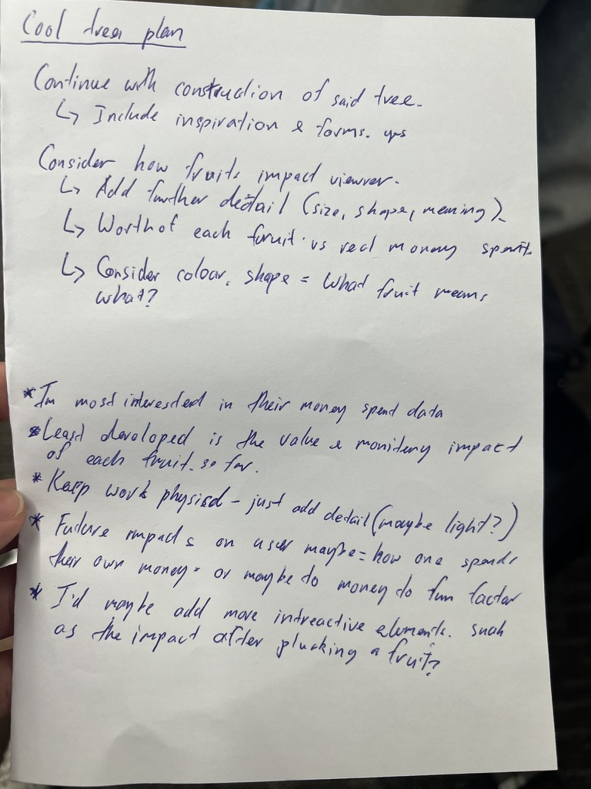
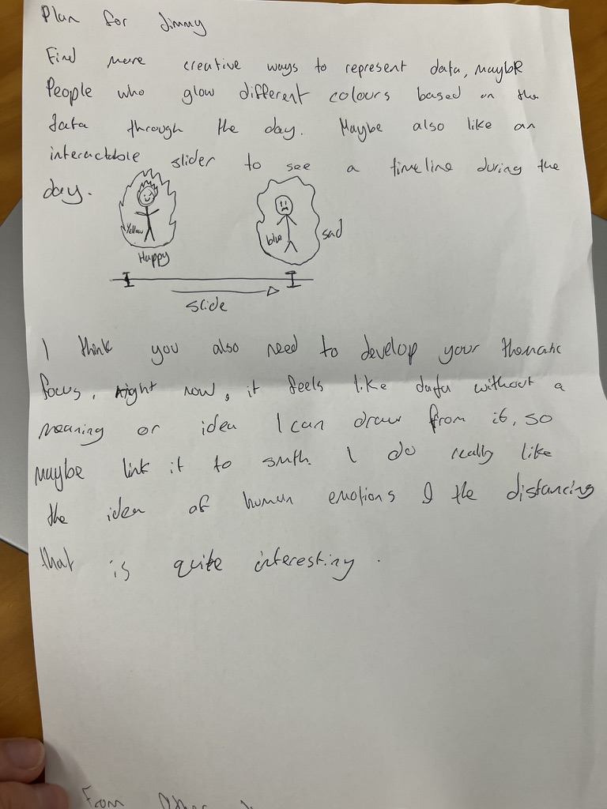

# Week 08

[← Back to Home](../index.md)

## Progress Report 

In class, I showcased my progress report presentation on Hesperides, which can be found [here](https://www.canva.com/design/DAHI9wrn3i4/xt657oLMum1mxGB3JDcDkg/edit?ui=e30). In my presentation, I went over my concept, where my project currently stands, my key developments and decisions, some research and references, and finally, some questions for my group.

At this stage, my project was focused on creating a physical data visualisation based on my personal spending during May. The idea was to create a tree inspired by the Greek myth of the Hesperides, where the fruit would represent different parts of my spending data. I wanted the project to explore ideas of value, temptation, desire, and regret through a physical object.

The two questions I asked my group were:

1. "Should I attempt to create this sculpture out of recycled materials, or should I use either 3D printing or laser cutting?"

2. "Is there anything you would add or change to more closely link this idea to data design?"

### Feedback on Materials and Making

I asked my first question because I was finding it hard to conceptualise what materials I would actually use to make my sculpture. At first, I wanted to create the whole thing out of recycled materials, but I started to realise that it may be easier and cleaner to use laser-cut materials. I also wanted to make my idea less broad, as I felt like I had too many different themes happening at once, such as AI, the environment, greed, desire, and spending habits.

Because of this, I wanted some final input from my classmates. After explaining my thought process, many of them agreed that I should focus my idea more. They also said that it would be much easier to use the laser cutter in the Design Lab, especially since I could still use recycled materials if I wanted to keep that part of the project.

I think this feedback was helpful because it made me realise that using the laser cutter does not completely remove the handmade or physical side of the project. It just gives me a more stable way to create the main structure. This helped me move away from thinking that recycled materials and digital fabrication had to be separate options. Instead, I could use both by laser cutting recycled cardboard or other found materials.

### Feedback on the Data Design

My second question was asked because, during my design process, I realised that my project was starting to lean more towards a fine arts project rather than a designing-with-data project. I still liked the sculptural side of the work, but I wanted to make sure the data was not getting lost.

The feedback I received here was useful. I was told to consider other ways of displaying the data instead of only hanging apples from the tree. For example, I could use different coloured branches for different spending categories, or fallen fruit to show purchases that I felt were less useful or more regretful.

This helped me realise that I need to make the rules of the visualisation clearer. At the moment, the fruit idea works well as a symbol, but I still need to make sure each part of the sculpture has a clear data purpose. For example:

- the size of the fruit could show how much money was spent
- the colour of the fruit could show the spending category
- the distance from the trunk could show how useful the purchase felt
- fallen fruit could show regretful or unnecessary purchases

This feedback helped me shift the project from just being a symbolic sculpture into something that more clearly works as a data physicalisation.

### What I Took From the Progress Report

I also received other feedback from my groupmates that I found interesting. Many of them said that they enjoyed the concept and liked how I was inspired by the Greek myth of the Hesperides. Some people also said that they would actually enjoy tracking their money and budgeting if it was done through a physical method like this.

I thought this was useful feedback because it showed me that the project could make something boring, like budgeting or spending data, feel more engaging and personal. It also showed me that the physical side of the project could be one of its strengths, as it makes the data feel more emotional and easier to relate to.

Overall, I think this progress report helped me understand what parts of my project are working and what parts still need to be clearer. I think the strongest part of my project right now is the concept of using the Hesperides myth to talk about value, temptation, and spending. However, I still need to make the data system easier to understand. Moving forward, I want to focus on making sure each part of the sculpture clearly represents something from my spending data, rather than just looking nice as an object.

## Critical Design Propositions

Afterwards, we got together with another group and split into pairs to share our projects and feedback. I paired up with the other Jimmy in the class. I explained my project to him by quickly going over my slides, then explained the questions I asked and the feedback I received from my group.

### Feedback I Received From Jimmy Tran

Jimmy found my concept the most interesting part of the project. He liked the Greek mythology aspect that my design was centred around, and he also found it interesting that I was making a physical project instead of a digital one.

He mentioned that if I were to create it online through p5.js, I could make it interactive and allow users to input their own recent spending into a database. This could make the project more personal for each viewer and allow them to compare their own spending habits with mine.

However, he also thought that I was already quite far into my physical version, so it probably made sense to stay with that direction instead of changing the whole project into a digital one. I agreed with this because I think the physical tree is one of the main things that makes my project feel different from other projects in the class.

The main weakness he pointed out was the way I was showing the data. Although he liked the idea of using fruit, he thought there could be more ways to add impact or show more data points creatively. This connected back to the feedback I received earlier about making the data system clearer.

He also thought that my future scenario or impact could be stronger if the project encouraged people to think more deeply about what they do with their money and how they spend it. Finally, if he were to do anything differently, he said he would add more interactivity, as he felt that was the most lacking aspect of my design.

  
*Jimmy Tran's feedback notes on my project*

This feedback was useful because it helped me think about the balance between physical and interactive design. Even though I do not think I will fully move the project into p5.js, I could still think about how the physical object invites interaction. For example, viewers could walk around the tree, compare the fruit, read the project statement, or reflect on their own spending habits.

### Feedback I Gave To Jimmy Tran

Afterwards, we swapped roles, and I gave Jimmy  feedback on his project. His project was based on data about how two people felt when they were together. He said that he got two of his friends to report back at the end of the day when they were together, and then used this information as the basis for his visualisation.

I thought his data was quite interesting because it focused on emotion and relationships, rather than something more numerical or straightforward. I liked that the project explored how spending time with friends and loved ones can affect people's moods. However, I thought that the least developed part of his design was probably the impact. I liked the concept, but I did not fully understand what kind of feeling or message he wanted the viewer to take away from the data.

The design proposition I developed for Jimmy was an interactive relationship map that shows how emotional closeness changes over time. Instead of only showing the mood data as separate points, the visualisation could place the two people as moving circles on screen. As the day progresses, the circles could move closer together or further apart depending on how connected they felt.

The colour of each circle could also change to show mood. For example, warmer colours could show positive emotions, while cooler colours could show tiredness, distance, or discomfort. A timeline at the bottom of the screen could let the viewer move through different moments in the day and see how the relationship changes.

This would add to Jimmy’s current approach by making the emotional data easier to read as a changing relationship, rather than just a set of mood records. It would also make the impact clearer because the viewer could see how time spent with another person affects both mood and closeness. If this were my project, I would focus on making the interaction simple, so the viewer can understand the emotional shift without needing a long explanation.

  
*My feedback notes for Jimmy Tran's project. Most of my feedback was also given verbally during the discussion.*

Giving feedback to someone else also helped me reflect on my own project. When I was commenting on Jimmy's work, I realised that I was also asking similar questions about my own project. For example, I was thinking about whether the viewer would clearly understand the emotional meaning behind the data, and whether the visual choices were strong enough to communicate the impact. This helped me see that I need to be more intentional with my own visual rules as well.

## Next Steps and Reflection

Overall, I think this progress report was positive because I was able to get a lot of useful feedback from my peers. A lot of people seemed to enjoy my concept and idea, especially the themes I am trying to explore around value, temptation, spending, and regret. However, I also received feedback that showed me the data side of the project still needs more development.

The most important thing I need to work on next is the visualisation of my data. I need to make sure the project is not just a sculpture with apples attached to it, but a clear data physicalisation where each design choice has meaning.

The main things I need to decide are:

- what each fruit will represent
- how the size of each fruit will be calculated
- whether colour will show spending categories
- whether fallen fruit will show regretful or less useful purchases
- how distance from the trunk will show usefulness or value
- how the project statement will explain the data clearly
- how viewers will understand the project without needing me to explain it in person

I also need to start thinking more about how I will actually make the final object. At the moment, I am leaning towards using laser-cut materials for the main structure, as this would make the tree more stable and easier to build. However, I still want to include recycled materials somewhere in the project, because I think that links well to the environmental and consumption-based ideas behind the work.

This week helped me move my project forward because it gave me clearer feedback from other people. Before this, I was mostly thinking about how the project looked and what it meant conceptually. Now, I am thinking more about how the data will actually be read by the viewer. Because I had other assignments due this week, I was not able to complete a major physical prototype outside of class. However, I still used the feedback to make clearer decisions about the direction of the project. My main focus moving forward is to create a stronger data system before I begin making the final sculpture. This means deciding how fruit size, colour, placement, and distance from the trunk will work together as a visual language. My next step is to test this system with a small section of my spending data, so I can check whether the sculpture communicates clearly without needing me to explain it in person.