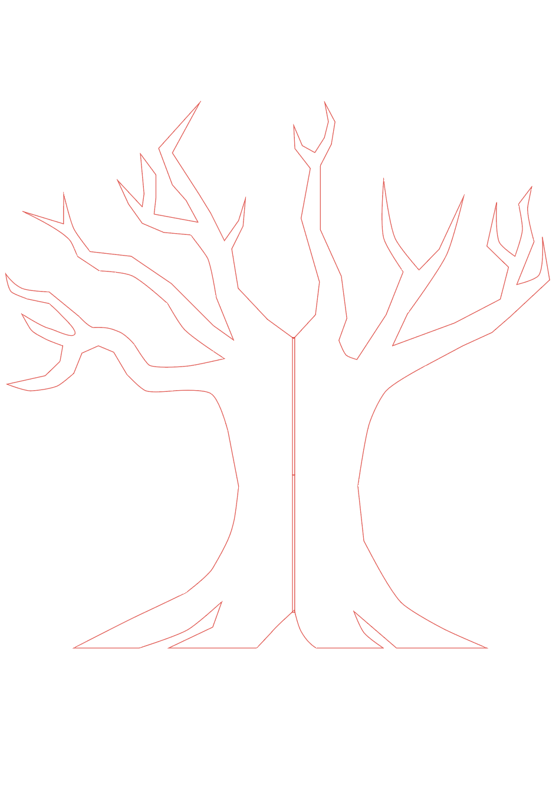
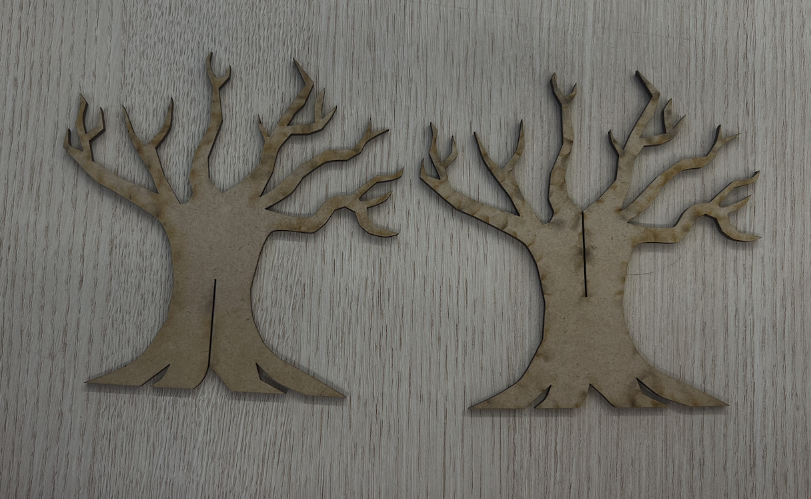

# Week 09

[← Back to Home](../index.md)

## Project Statement: First Draft

For the first draft of my project statement, I used NotebookLM to generate a statement based on what I had so far in my making journal, as well as my original proposal for Hesperides.

s"My project, Hesperides, is a physical tree sculpture made from recycled cardboard and papier-mâché. The trunk of the tree represents me, while the branches represent different spending categories such as food, rent, transport, and other purchases. Each purchase is shown as either a piece of “fruit” or a leaf. The size of the fruit shows the cost of the purchase, while its distance from the trunk shows how necessary or impulsive the purchase was.

The data for this work comes from my personal bank statements, receipts, and notes recorded throughout May. By documenting every transaction in a spreadsheet, I have created a self-collected dataset that reflects my daily habits, needs, and priorities.

The project focuses on personal spending habits and how money can reflect a person’s values. It also imagines a future where digital finance apps do more than track spending. Instead, they judge people based on their purchases, labelling them as “responsible”, “essential”, or “wasteful”. To deepen this idea, I have drawn from the Greek myth of the Garden of the Hesperides, which centres around a tree of golden apples. In my work, the tree becomes a symbol for desire, value, money, and the things people reach for, while the fruit represents the temptation and perceived worth of modern consumption.

This work also questions the idea that data is always neutral or objective. By turning my data into a physical, handmade sculpture, I want to move away from the coldness of digital graphs and AI-generated design. The recycled materials and imperfections of the sculpture are important because they make the data feel more human, personal, and expressive.

The use of recycled cardboard and paper is also a deliberate choice. It links my personal spending data to wider ideas of waste, overconsumption, and the environmental impact of consumer culture. By creating the “fruit” from discarded materials, I want to connect everyday financial habits to the larger systems of production and waste that often go unnoticed. The intended impact of Hesperides is to make viewers reflect on their own consumption habits, and to question the systems that encourage people to keep spending without thinking about the consequences."

## Evaluation of First Draft

I think the NotebookLM draft explains my concept quite well. It is clear and concise, and it brings together the main parts of my project, such as the spending data, the tree sculpture, recycled materials, and the idea of consumption. I also like how it connects the physical form of the tree to the structure of my data.

However, I think the myth of Hesperides needs to be pushed further to the front. At the moment, the draft explains the myth, but it still feels like it is sitting behind the spending data rather than shaping the whole project. I want the golden apples to feel more central because they connect strongly to desire, temptation, value, and reaching for things that may not always be necessary.

I also think the data representation still needs more development. I have a basic system where size shows cost and distance from the trunk shows how necessary or impulsive the purchase was, but I still need to test whether this will be clear to viewers. I may need to think more about colour, labels, materials, or branch placement so that the sculpture can be read as data and not just as an abstract tree.

The draft also feels slightly too polished and AI-like in some areas. This is ironic because part of my project is about pushing back against the overuse of AI in design. Because of this, I need to make sure the final statement has more of my own voice and feels connected to my actual making process. I think further research will come as I begin working more directly with the physical sculpture and testing how the data can be shown through material.

One sentence that commits to my direction:

I am committing to making Hesperides as a handmade data sculpture that uses the myth of the golden apples to explore spending, temptation, waste, and the human side of personal data.

## Peer Share Feedback

After sharing my project statement with a peer, the clearest part seemed to be the tree and golden apple metaphor. They understood that each purchase would become part of the sculpture, and that the final work was about more than just money. The idea of using recycled materials also seemed to make sense because it connects the project to waste and sustainability.

The main thing that still needs to be developed is how the data will be mapped onto the sculpture. For example, I need to decide whether larger purchases will become larger fruit, longer branches, different colours, or different materials. I also need to make sure the viewer can understand the visual system without needing a long explanation.

This feedback helped me realise that my next step should be less about adding more ideas, and more about testing how the data will physically appear. I already have a strong concept, but the project will only work as data design if the viewer can clearly read what each visual choice means.

## Making Sprint

For the making sprint, I wanted to start physically working towards my final project. Before this point, most of my progress had been based on thinking, writing, sketching, and planning. During the making sprint, I began constructing the laser-cutting file in Adobe Illustrator. This took a while because I wanted to get the shape and structure right, so it took up most of the making sprint time.

As seen below, I was able to create the main look of my tree. I am happy with this outcome because it starts to show how the physical sculpture might actually work, rather than only existing as a sketch. The tree shape also connects well to the Hesperides myth, while still leaving space for the fruit to hold the data.

  
*Illustrator file created during the making sprint for the main tree structure*

The main thing I would change is the height of the tree. At the moment, I feel like it looks slightly bottom-heavy and stout. I think making it taller could make it look more elegant and tree-like. However, making it taller could also make it harder to laser cut, as it would take more material and may not fit within the size limits of the laser cutter. This is something I will need to test before deciding on the final scale.

This making sprint was useful because it helped me move from concept development into technical making. I also started to understand the practical limits of the project, such as material size, laser cutter space, and how stable the tree might be once it is cut out.

## Round Robin Rapid Reactions

During the Round Robin activity, I showed my draft project statement and my making sprint outcome. The most useful feedback was that the concept felt personal and visually interesting, but the data system needed to be clearer. People could understand that the tree was representing money, and once again, they liked the concept. However, I was still receiving feedback about the actual visualisation of the data and how it relates to the concept.

Some questions that came up were:

- How will viewers know what each fruit means?
- Will the sculpture show the timeline of the month or just the total spending categories?
- Is the project more about personal spending, sustainability, or AI?
- Could the “golden apples” look tempting at first, but reveal something more uncomfortable when viewed closely?

This feedback helped me think about how the final artefact could have two layers. From far away, it could look like a beautiful tree with golden fruit. Up close, the viewer could realise that each fruit represents a purchase, and that the tree has grown from consumption.

I think the question about whether the project is more about personal spending, sustainability, or AI was useful because it made me realise how wide all my themes were. I had too many ideas happening at once, which could make the final project feel unclear. During my independent study, I started thinking about how to zoom in and be more critical. I decided that the main focus should be personal spending, temptation, and waste. AI can still sit in the background as part of my process and critique, but it should not become the main focus of the final artefact.

## Independent Study

After the making sprint, I continued developing the project by thinking more carefully about how the data will be mapped. I do not want Hesperides to become too complicated, because if there are too many categories, the sculpture may become confusing. Instead, I think I need to focus on a few clear data fields:

- the amount spent
- the spending category
- whether the purchase was essential or non-essential
- whether the purchase felt useful or regretful afterwards

During my independent study, I also started the first test print of my main tree trunk. I took the Illustrator file into the Design Lab and used some leftover MDF wood to test how the tree would cut and look as a physical object.

  
*First laser-cut test of the main tree structure using leftover MDF wood*

This test was important because it helped me see the project as a real object instead of only a digital file. It also helped me check whether the tree shape would work once it was cut out. Seeing the test print made me think more about the scale, stability, and how the fruit would eventually hang from the branches.

I also began to update my project statement using my own words, which can be seen below:

**Hesperides:**  
At the edge of the west lies a garden, and in the centre sits the great tree of golden apples. Inspired by the Greek myth, Hesperides is a physical sculpture made from laser-cut wood and recycled materials. Hung from its branches, in the form of the golden fruit from the myth, are the spending habits of designer Jimmy Ma across the first 14 days of May. Each fruit holds key information, such as the amount spent, what the item was, and whether that money was truly important. Hesperides explores how personal spending grows from everyday choices, while questioning the desire, convenience, and waste behind modern consumption.

I think this updated version feels more like my own voice compared to the NotebookLM version. It is shorter, more direct, and places the myth at the start. This helps make the project feel more connected to the golden apples rather than just using the myth as a small reference.

I also decided that I wanted to have the apples cut in half. This would make it easier to write the data onto each fruit and make the information more visible to the viewer. I might also try using colour or text that looks like worms inside the apples, especially for purchases that are less useful or more regretful. I think this could be a strong way to show that something may look tempting on the outside, but feel wasteful or uncomfortable when examined more closely.

## Progress Report Preparation

For this week's progress report, I copied and pasted the formatting from my previous slideshow progress report, then updated the content. I included my AI-generated project overview draft, my laser-cutting plan, and some updated visual images for inspiration based on my new direction. I also added new questions to ask my group so I could get feedback on the areas I was still unsure about.

The main things I wanted feedback on were:

- whether the cut apples made the data easier to read
- whether the laser-cut tree structure worked visually
- how I could make the data system clearer
- whether my project should focus more on spending, sustainability, or AI
- how to make the final artefact more critical and less decorative

[Presentation Link](https://www.canva.com/design/DAHI9wrn3i4/xt657oLMum1mxGB3JDcDkg/edit?ui=e30)

## AI Usage Statement

I used NotebookLM to generate the first draft of my project statement, as asked for by Leo. 