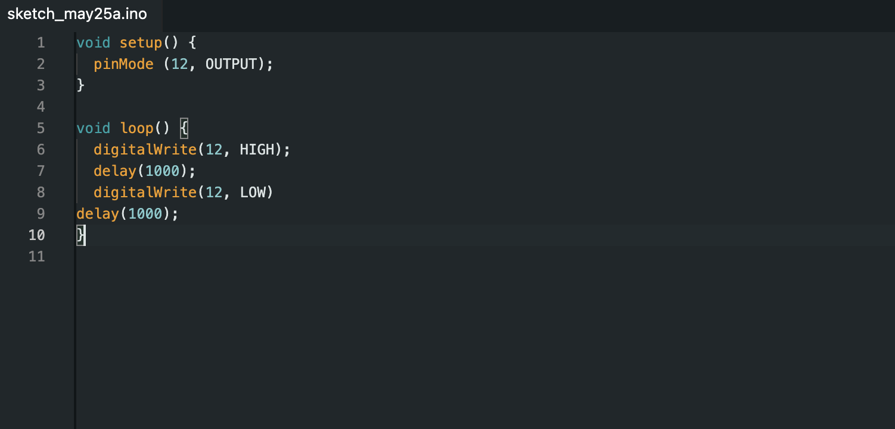
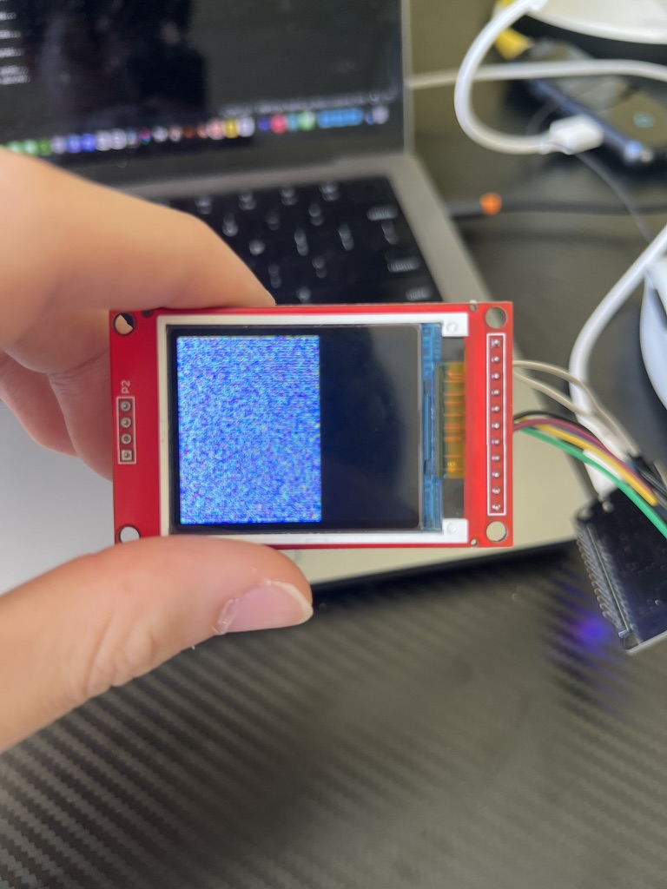
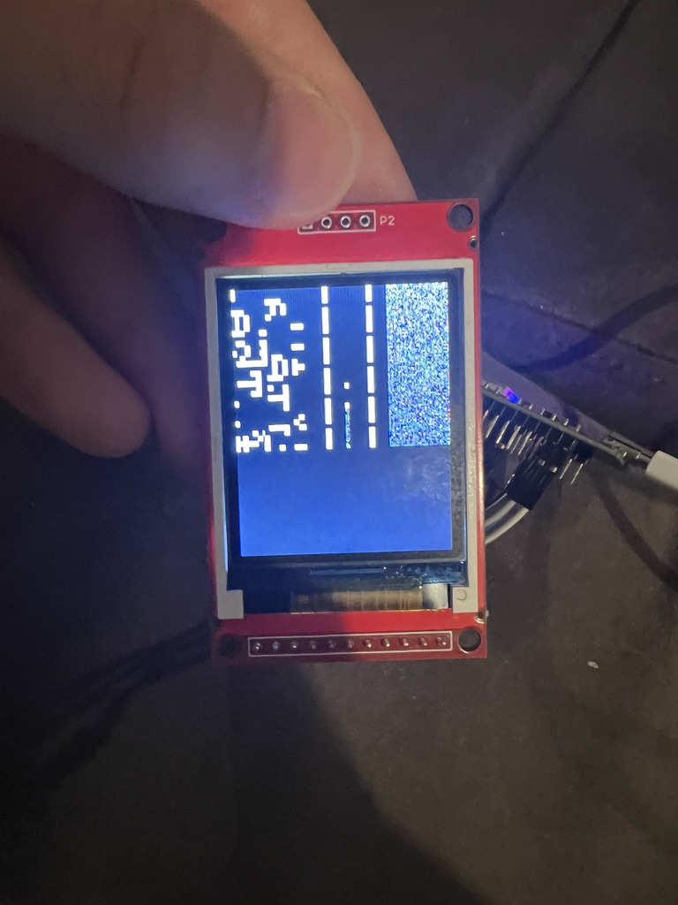
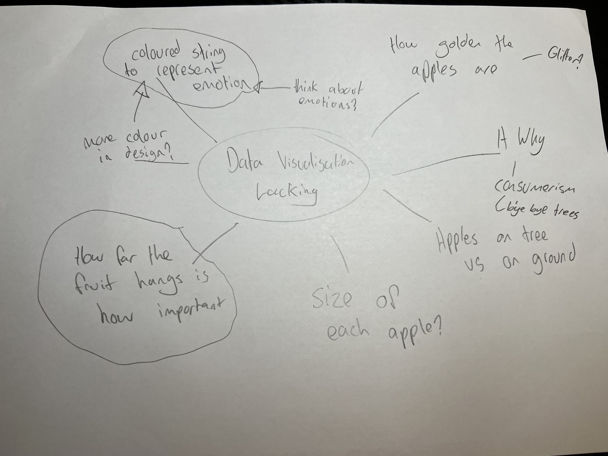
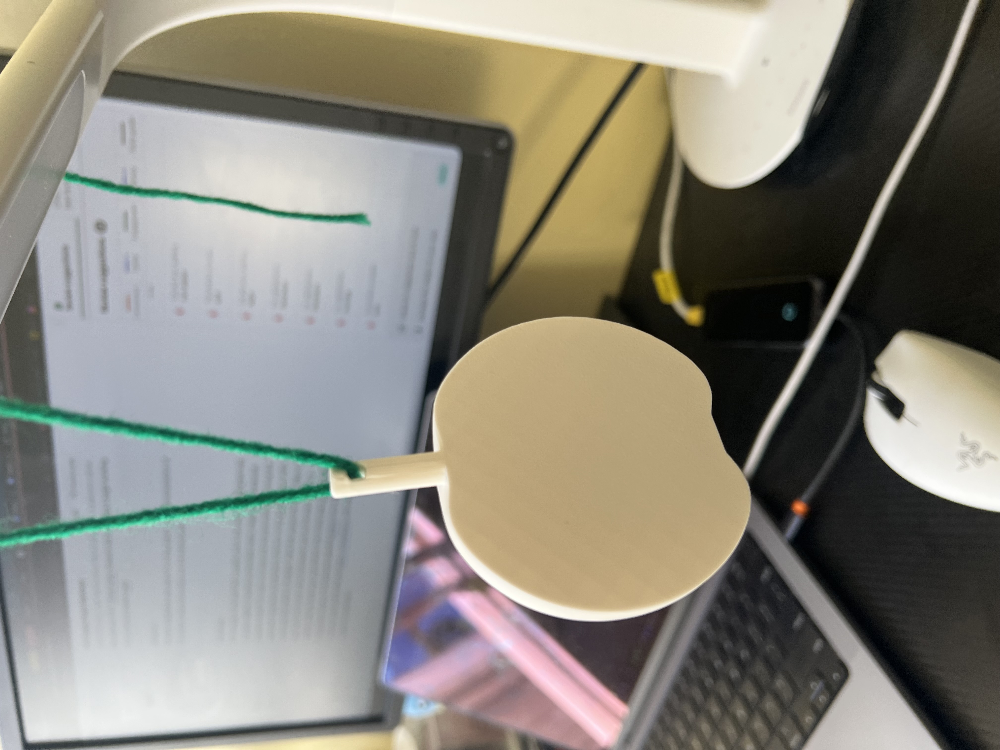
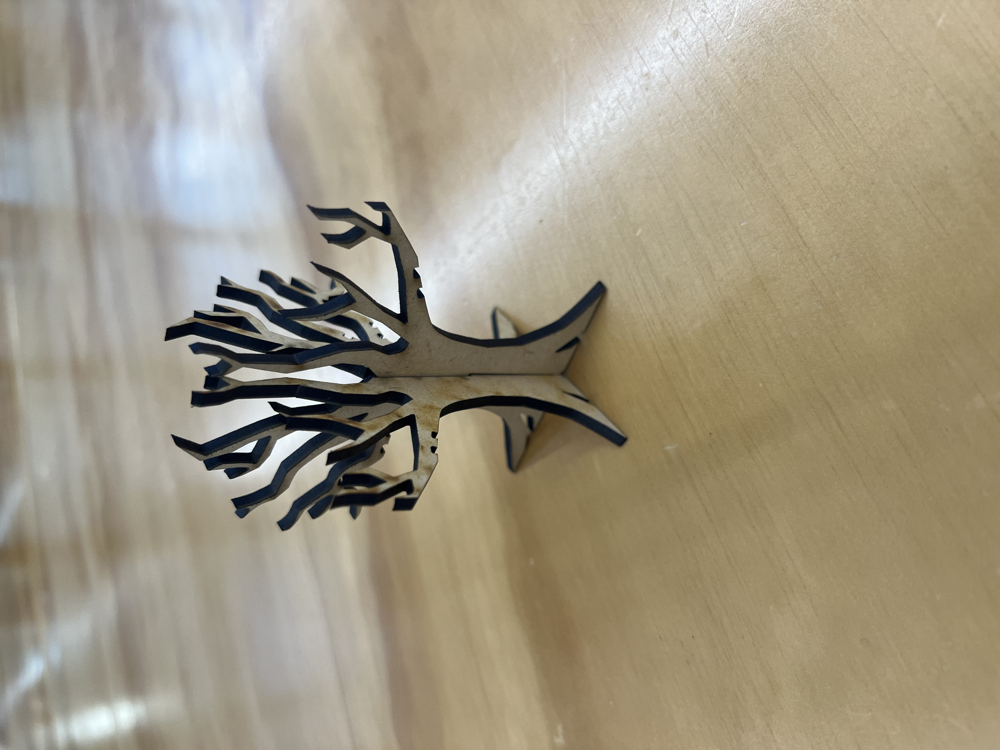

# Week 10

[← Back to Home](../index.md)

## Progress Reports

Class in Week 10 started with sharing our progress reports in a similar way to the previous one. During this, I shared my updates with the group, including what NotebookLM gave me for the draft project overview and how I have decided to zoom in on a few key themes instead of trying to focus on too many at once.

The two questions I asked my group were:

1. "How do we feel about the cut apples being used to show data, and how could I further develop the data aspect of my design?"**

2. "What do we feel about my theme of desire, convenience, and waste behind modern consumption?"**

I got some useful feedback from the group. People said that they liked my new direction of having the apples cut in half because it made the data easier to display and understand. They also said that the less useful apples could be the ones with worms in them, while the healthier and more useful apples could be placed higher up on the tree.

This feedback was helpful because it gave me a clearer way to connect the visual form of the apple to the meaning of the data. Before this, I was mostly thinking about apples as objects that could hold information. After the feedback, I started thinking about how the condition of the apple itself could become part of the data system. For example, a clean apple could represent a useful or necessary purchase, while an apple with worms could represent a regretful or wasteful purchase.

## Gallery Walk

While we were doing our progress reports, we also used a website called Padlet, where we could write down our feedback and share it with each other. The only issue was that my group did not fully understand this at the time, so a few people did not write their feedback there. However, I still think Padlet was a useful tool because it created a place where feedback could be saved and returned to later.

Even though I only received a small amount of written feedback through Padlet, the feedback I did get was still useful. I think this activity could have worked even better if it had been introduced earlier in the semester, as people would have been more comfortable using it during critique sessions.

During the Gallery Walk, I also looked at other groups’ Padlet boards and read through the technical and conceptual feedback they had received. One thing I noticed was that the strongest projects were not always the most complex. They were the ones where the data system could be understood quickly.

This helped me reflect on my own project because Hesperides has a strong concept, but the viewer still needs to understand how the data is being shown. From looking at other projects, I realised that I need to make my visual rules simple and consistent. If each apple shows too many things at once, the work could become confusing. Because of this, I want to focus on a few clear mappings: apple size for cost, string colour for emotion, and apple position for importance

## Action Plan

The most useful feedback I got this week was that my project feels stronger now that I have narrowed my theme down. Instead of trying to show too many ideas at once, the group seemed to respond well to the focus on desire, convenience, and waste behind modern consumption**. This helped me realise that my project does not need to explain every part of food waste, AI, sustainability, and spending habits. Instead, it should make one clear point through the apple tree form.

A key piece of feedback was around the cut apples. People liked the idea of the apples being sliced open because it makes the data easier to display and understand. To develop this further, I want to make the inside of each apple show a clearer data value, such as cost, usefulness, or waste linked to each item.

I also want to explore the suggestion of using worms in the less useful apples, while placing healthier or more useful apples higher up the tree. This could make the visual hierarchy easier to read without needing too much written explanation.

My next action point is to sketch a clearer data system for the apples. I need to decide what each visual feature represents, such as:

- apple size
- apple position
- apple colour
- string colour
- worms or damaged sections
- whether the apple is hanging or placed on the ground

I also want to create a few quick visual tests to see whether the audience can understand the data without me explaining it first. From there, I will refine the tree structure so the final piece feels more connected to my theme and clearly communicates the tension between what we desire, what is convenient, and what becomes waste.

## Independent Study: Testing Interaction With a TFT Screen

During Week 10, I talked to the lab techs about using a TFT screen and an ESP32 to create an interactive way for people to input their own data and have it show up on the screen. From this talk, I began experimenting over the weekend with both the TFT screen and the ESP32.

I first started with a breadboard, the ESP32, and an LED. Following some online tutorials, I was able to connect the LED and ESP32 on the breadboard and create some code in Arduino IDE to get the LED to light up for one second every second.

  
*Code used to get my LED to light up*

This first test was useful because it gave me a basic understanding of how the ESP32 worked. It also made me feel more confident about trying to create a more interactive part of the project. However, I moved from the LED to the TFT screen too quickly.

After feeling confident with my computer science skills from high school, I made a big jump from working with the LED to working with the screen. This was not the best decision. I think I should have continued experimenting with the breadboard and the ESP32 first, because I quickly got lost once I started trying to connect the screen.

What I failed to realise was that each TFT screen is different and has unique ports depending on its specifications. I figured this out eventually, but then I ran into another issue. The TFT screen I was given from the Design Lab had no labels and no clear way to figure out the exact specs. This made it hard to find the correct wiring and setup instructions online.

After getting help from my much smarter friends and flatmates, I was eventually able to get the screen and ESP32 connected. However, I then ran into another issue. The screen seemed to have a bug where it would not fully reset before running the code. This caused half of the screen to not work unless something updated the pixels in the bugged region.

  
*Half of the screen not displaying properly while running an Arduino IDE example sketch*

  
*The screen slightly more visible after parts of it were updated during the sketch*

After running into these bugs, I went back to the Design Lab for help. I was able to get the screen mostly working, but it was still extremely unreliable. I also tried another screen, but it had the same problem. Because of this, I came to the conclusion that the issue was most likely caused by my wiring or not having the correct screen specifications.

With so little time left to figure it out, and without being able to find the correct specs for the TFT screens, I eventually had to give up on this idea.

Although this part of the project did not work, it was still an important technical experiment. It helped me understand the limits of adding digital interaction this late in the process. It also taught me that adding technology does not automatically make a project stronger, especially if it takes focus away from the main concept and data system.

## What Comes Next

After the TFT screen testing failed, I began to slightly panic because I felt like I had spent almost 12 hours on something that did not end up working. Although I did learn new information about TFT displays, ESP32s, wiring, and C++, I still felt like this whole section was useless at first.

However, after stepping back, I realised that the failed experiment still helped me make an important design decision. It showed me that I did not need to force digital interaction into the project. Instead, I could create interaction through the physical object itself.

I still felt that my data project lacked meaningful interaction, as well as a clear way of showcasing my data. From this step back, I began moving forward again. I first tackled the part of the project that felt weakest to me, which was the data physicalisation.

I was not sure if I liked the idea of having all the data written directly onto the apple. After a lot of brainstorming and ideation, I came up with two useful solutions.

The first idea was using coloured string or yarn to represent the emotions I felt during the purchase. I was always going to have the apples hanging, but before this, I was planning to use invisible nylon thread to hide the hanging method. I now think using coloured string to hang the apples could help display data more effectively. It also gives the viewer another layer to think about, because the string is no longer just a support material but part of the visualisation.

The second idea was changing the location where the apple is hung to show how important that purchase was to me. This makes the project more personal because importance is not always something that can be measured in a fully objective way. Each person may interpret the importance of a purchase differently, which connects to the human side of personal data.

A third idea was to have extra apples and string lying around next to the display, where people can add their own data points. This would create interaction without needing a screen. Instead of typing into a digital interface, viewers could physically add their own spending data to the tree. I think this fits the project better because it keeps the interaction handmade and material-based.

  
*Brainstorming after stepping back from the TFT screen idea*

## Updated Data System

After reflecting on the feedback and the failed TFT screen experiment, I started to develop a clearer data system for the final sculpture. At this stage, I am thinking about using the following rules:

- Apple size shows how much money was spent.
- Apple position shows how important or useful the purchase felt.
- String colour shows the emotion linked to the purchase.

This system feels stronger because the data is not only written onto the apples. Instead, the material, placement, and form of each apple all help communicate the meaning. I think this makes the project more suitable as a physical data visualisation because the audience can read the data through the object itself.

## Prototyping

After deciding on this new direction, I began prototyping both the apples and the tree trunk.

I started by using Fusion, as I have previous experience with it, to create a model of an apple. I then tested a print using my 3D printer at home. This first print turned out well, and I tested it with coloured yarn, which can be seen in the photo below. This helped me see how the apple could hang from the tree and how the string could become part of the data system. Afterwards I then went to the lab to print off some other apples which would be my final apples as the prototype went really well. 

  
*3D printed apple prototype tested with coloured yarn*

After that, I tested my laser cutting again. My previous laser-cut test did not slot together properly because I did not account for the width of the material I was using. This time, I tested on a very small piece of leftover material and was able to get it slotting together correctly.

  
*Small laser-cut slotting prototype used to test the material thickness*

This was an important technical improvement because it helped me understand how the final tree structure will need to be designed. If the slots are too tight, the pieces will not fit together. If they are too loose, the tree will not stand properly. Testing this on a smaller piece of leftover material helped me avoid wasting larger pieces later.

Overall, this week involved a lot of trial and error. The TFT screen experiment did not work, but it helped me realise that digital interaction was not the right direction for Hesperides. Instead, the interaction should come from the physical object itself: viewers reading the apples, comparing their positions, following the coloured strings, and possibly adding their own spending data to the tree. The progress report feedback helped me narrow the theme, while the prototyping helped me build a clearer material system. My next step is to refine the apple data system, test whether people can understand it without explanation, and continue developing the final tree structure at a larger scale.

