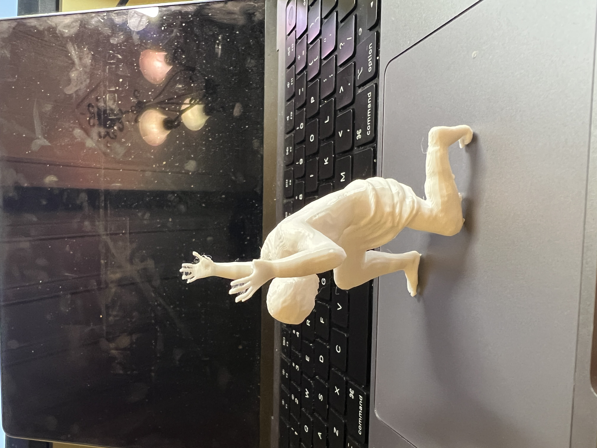
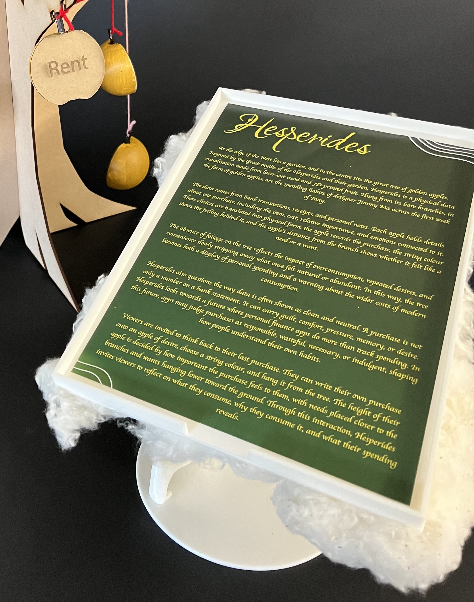
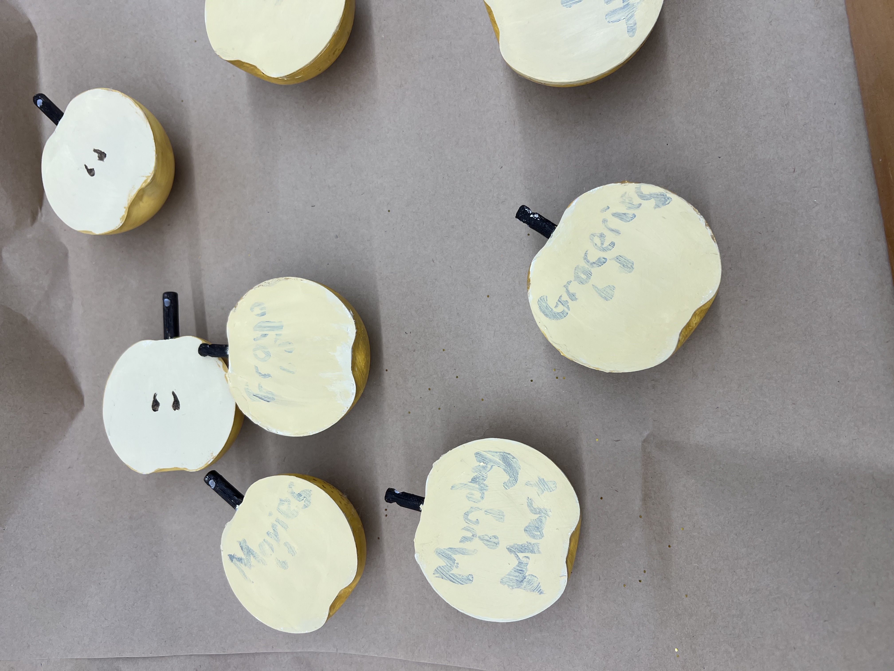
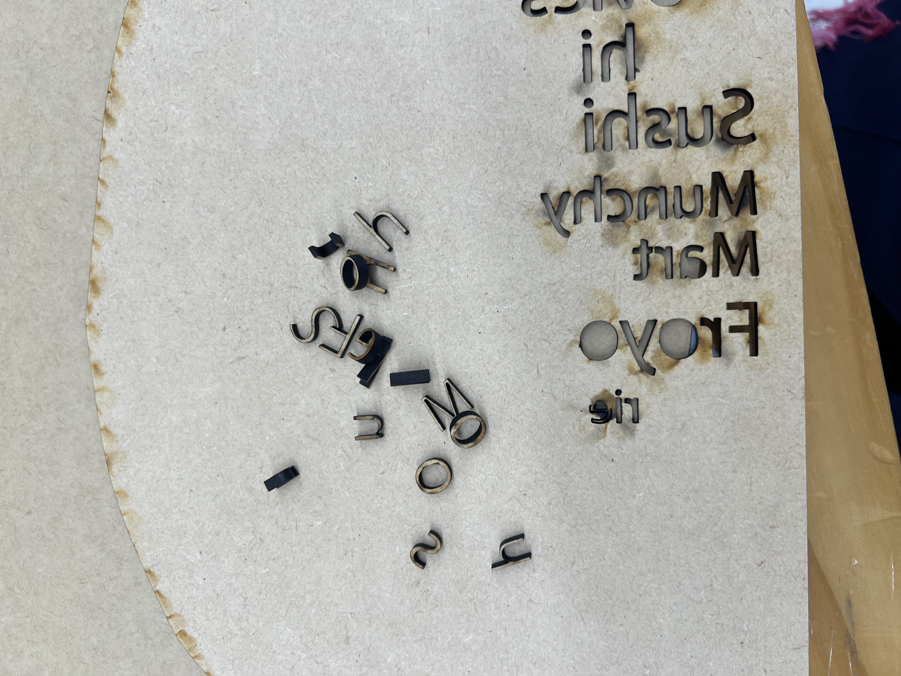
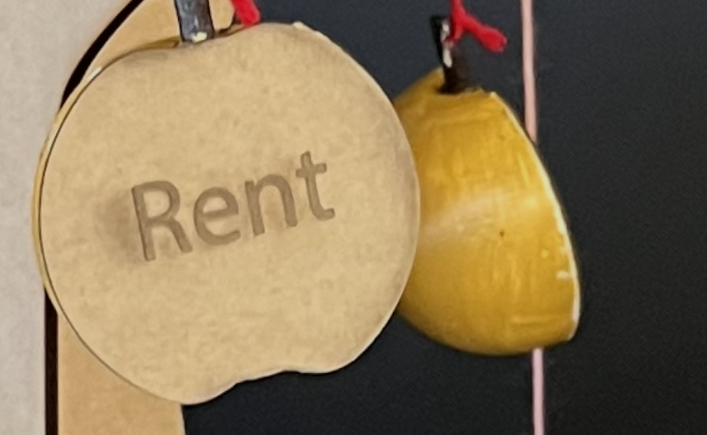

# Week 11

[← Back to Home](../index.md)

## Journal Review

At the start of class, we worked in pairs to review each other’s making journals from Weeks 6–10. The aim was to check clarity, completeness, the balance between visuals and text, and whether the GitHub Pages formatting was working correctly.

During part of this activity, I was in the Design Lab working on the physical project, so I joined the review slightly later. However, one of my friends was still able to quickly read through my pages and check whether the main sections were present. This was helpful because they noticed that some information was missing from a few journal entries. It reminded me that the journal is not only about showing the final result, but also about showing the process clearly enough for someone else to understand how the project developed.

After this, I identified three key moments that shaped my project direction:

Narrowing the concept
Around Week 6, I had too many broad ideas happening at once, including AI, sustainability, spending habits, waste, and Greek mythology. This made the project feel unclear. A key turning point was deciding to focus more clearly on personal spending, temptation, convenience, and waste.
Moving away from digital interaction
In Week 10, I experimented with ESP32s and TFT displays because I wanted to add interaction to the project. This took a lot of time and did not work well enough to include in the final artefact. However, it helped me realise that the interaction should stay physical, through the viewer reading the apples, following the coloured strings, and possibly adding their own data.
Starting physical prototyping
Another key moment was beginning to prototype the artefact. Once I started laser cutting, 3D printing, painting, and testing the apple forms, the project became much clearer. Making the physical object helped me understand scale, material limits, and how the data could actually be displayed.

## Practice Consultation

After the journal review, we completed practice consultations in pairs. The aim was to prepare for the Studio Consultation by practising how we explain our project, data source, design journey, impact, and critical position.

The prompts we used were:

Tell me about your project’s theme.
What is your data source? How did you access or collect it?
Tell me about a key moment in your design journey.
How does your work challenge conventional ideas?
What impact do you want your visualisation to have?
What surprised you most in the making process?

During my practice consultation, I was able to speak for roughly nine minutes. This was useful because it showed me that I had a lot to talk about and that my ideas were becoming clearer. I felt more confident than expected because the project had developed enough for me to explain both the concept and the making process.

In my response, I explained that Hesperides is a physical data visualisation about personal spending, overconsumption, and the emotional meaning behind purchases. The project uses the Greek myth of the Garden of the Hesperides as its main theme, with golden apples representing spending data and the leafless tree symbolising the loss of natural resources caused by consumption.

My data came from my own spending during the first week of May, using bank transactions, receipts, and personal notes. Each apple represents one purchase, including details such as the item, cost, emotion, and importance. This allowed the data to become more personal than a normal bank statement.

A key moment in my design journey was realising that I had too many broad ideas and needed to focus on the strongest parts of the concept. Another important moment was deciding not to continue with the ESP32 and TFT display idea, as it took too much time and did not support the project strongly enough.

The project challenges normal data visualisation by turning personal data into a physical sculpture instead of a chart or digital screen. I want the work to make viewers reflect on their own spending habits and think about how everyday purchases connect to emotions, needs, wants, and environmental impact.

What surprised me most was how much the project improved once I started making physical prototypes. Painting the apples, testing the tree structure, and designing the Atlas display helped the project feel more resolved and more connected to the myth.

## Independent Study 

This week’s independent study started with painting my 3D-printed apples from last week. This took a while because I painted two layers of white and two layers of gold paint to make sure they looked clean and polished. I also bought some glitter to make the apples look shiny and more visually tempting. I then painted the insides to display the text and pricing of the different data points.

## Project Statement

I then finished my project statement. I found this quite challenging because I had a lot of information to condense into the 300-word limit. I knew I had to keep the idea of the Greek myth because that was the foundation for my concept, so I kept that at the start. I also wanted to lean more into the idea of overconsumption, so I referenced how the lack of leaves on the tree was a stylistic choice linked to the overuse of the world’s natural resources. Finally, I wanted to invite viewers to participate with the tree, so I added a section at the end that invites them into the work.

Afterwards, I also started thinking about how I wanted to showcase the project statement. I knew I did not want to keep it simple by placing a plain piece of paper next to the project, so I started brainstorming. Keeping with the Greek myth, the Garden of the Hesperides is connected to the Titan Atlas, who holds up the sky. I thought it would be creative if Atlas was holding up my project statement like it was the sky, as this would link back to the sculpture thematically.

I started by modelling a paper holder in Fusion, as I have previous experience with the program. Afterwards, I found a free-use Atlas model online (Model Link). I then went back into Fusion to edit it by removing the globe and adjusting his arms slightly so he could hold up the paper holder. I tested this by printing a few mini models to check that the design would work.

  
*Mini test Atlas*

Since I liked the test print, I then printed the full body and the paper holder in the Design Lab. After the two pieces printed, I superglued them together so it looked like Atlas was holding up the paper holder. I then added cotton that I had lying around to make it look like he was holding up clouds and to hide some of the print imperfections.

I also used Figma to design the A4 project statement so the text would look more intentional. I did not want to put effort into the holder and then have the paper itself look plain. Overall, I think the project statement reads and looks strong, which is important because it ties the project together and makes the display feel more complete.

  
*Final Project Statement In Holder*

## Final Tree
While working on the project statement, I was also working towards my final tree outcome. The first thing I focused on was finishing the apples. After painting the exterior I tried to paint the interior by adding the data directly onto the apples. However, I quickly realised that the text looked messy and hard to read, so I had to paint over it pivot in a new direction.

  
*Apples with data that look bad*

Since I was not happy with how the original apple interiors looked, I decided to redesign them. My first idea was to just cut out individual letters then glue them on the apple later. However when cutting out the letters in the lazer cutter I noticed two things, the first being that they were really small, and two, they were falling in between the gaps of the lazer cutter board. So I stopped the cut and instead 

  
*Attempt 1 at letters*

Since that didn't work I instead tried to use a thinner matboard to cut out the apple shape and then etch the words on the apple. I took the apple shape from my Fusion file, exported it into Illustrator, and then added the purchase data directly into the apple shapes. After this, I laser cut the designs onto matboard and used super glue to attach them to the final 3D-printed apples.

I think this was a strong improvement because the matboard made the data much clearer and easier to read. Instead of hand-writing the information onto the apples, the laser-cut pieces gave the text a cleaner and more intentional look. This helped the apples feel more like designed data objects, rather than just decorative props.

I also liked how the matboard created a contrast between the outside and inside of the apples. The outside still looks gold, shiny, and tempting, while the inside reveals the actual data behind the purchase. This supports the main idea of Hesperides, because the apples may look desirable at first, but when the viewer looks closer, they reveal the cost, importance, and emotional weight behind my spending.

  
*Apples with the lazer cut matboard*

Afterwards, I got a full-sized sheet of MDF from the Design Lab and laser cut the final tree. I also added small notches into the branches so I could tie the apples onto the tree more easily. This process went smoothly because of the smaller slotting prototypes I made earlier. After the pieces were fully cut, I assembled them using the slots I had designed. Finally, I added the apples and tried my best to follow the data I had collected.
  
*The final Tree Image*

Overall, Week 11 was focused on finalising the project and preparing it for the showcase. The main progress was completing the project statement, designing the Atlas holder, refining the apple data inserts, laser cutting the final tree, and assembling the final artefact. This week helped bring together the key parts of Hesperides: the Greek myth, the spending data, the handmade physical form, and the critique of desire, convenience, and waste.
