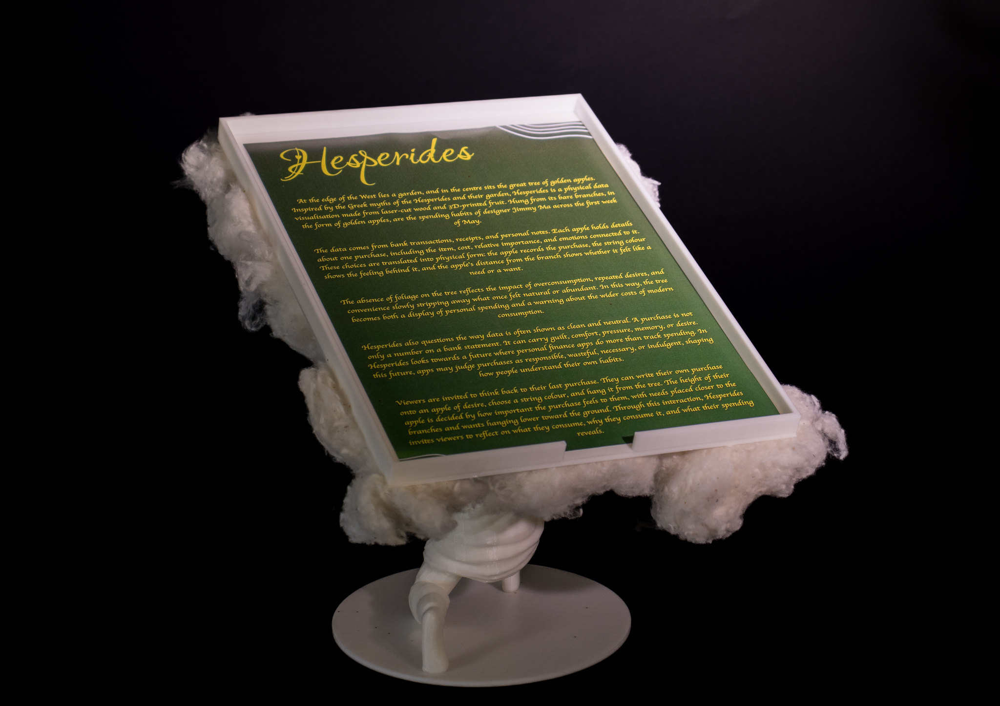
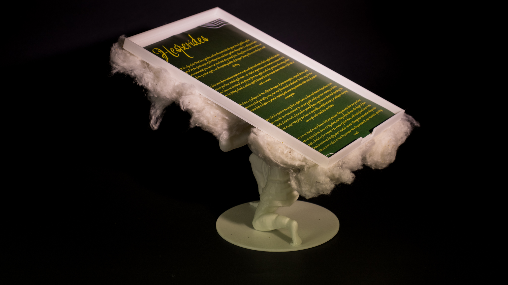
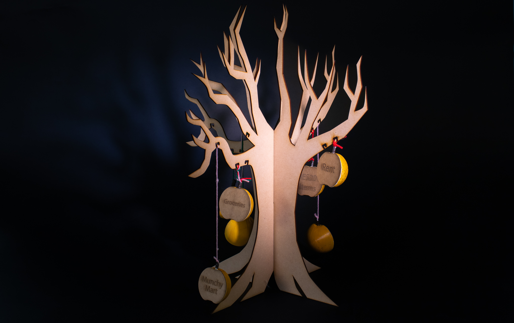
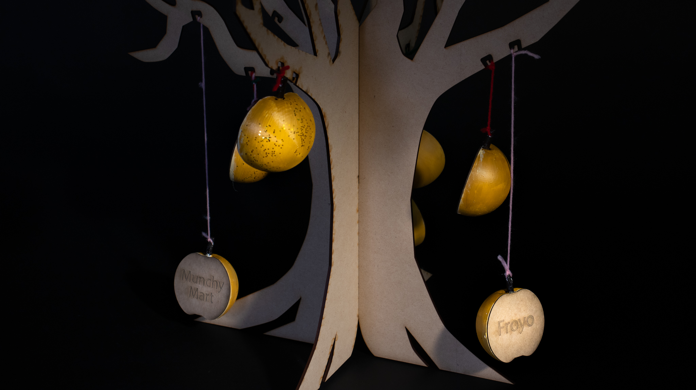
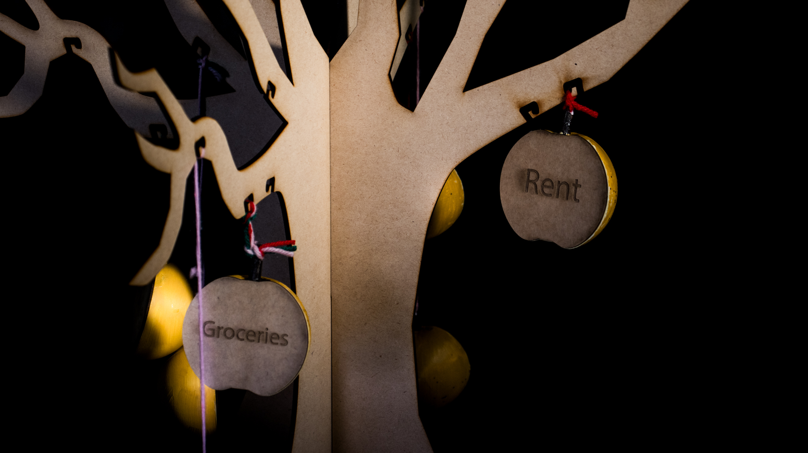
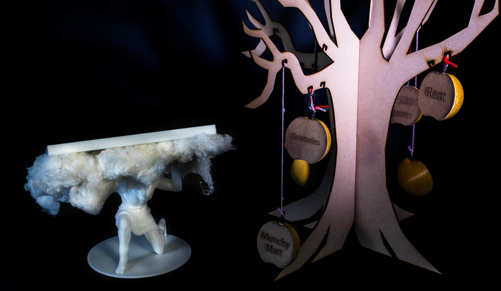
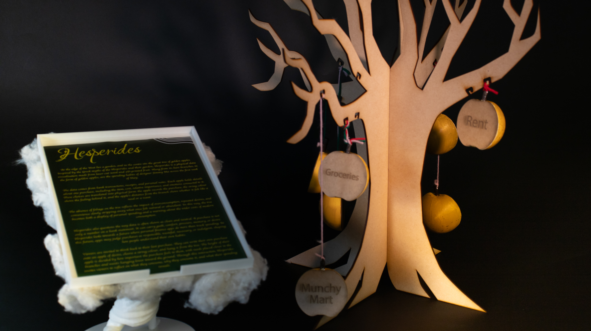

# Week 12

[← Back to Home](../index.md)

## Project Statement
At the edge of the West lies a garden, and in the centre sits the great tree of golden apples. Inspired by the Greek myth of the Hesperides, Hesperides is a physical data visualisation made from laser-cut wood and 3D-printed fruit. Hung from its bare branches are the spending habits of designer Jimmy Ma across the first week of May.

The data comes from bank transactions, receipts, and personal notes. Each apple holds details about one purchase, including the item, its relative importance, and the emotions connected to it. These choices are translated into physical form: the apple records the purchase, string colour shows the feeling behind it, and the apple’s distance from the branch shows whether it felt like a need or a want. Green = Happy, Red = Not Happy, Pink = Hungry.

The absence of foliage reflects the impact of overconsumption, repeated desires, and convenience slowly stripping away what once felt natural or abundant. In this way, the tree becomes both a display of personal spending and a warning about the wider costs of modern consumption.

Hesperides also questions how data is often shown as clean and neutral. A purchase is not only a number on a bank statement. It can carry guilt, comfort, pressure, memory, or desire. Hesperides looks towards a future where personal finance apps do more than track spending. In this future, apps may judge purchases as responsible, wasteful, necessary, or indulgent, shaping how people understand their habits.

Viewers are invited to think back to their last purchase. They can write their own purchase onto an apple of desire, choose a string colour, and hang it from the tree. The height of their apple is decided by how important the purchase feels, with needs placed closer to the branches and wants hanging lower toward the ground. Through this interaction, Hesperides invites viewers to reflect on what they consume, why they consume it, and what their spending reveals.

## Photos Of Hesperides

  
*Hesperides Project Statement 1*

  
*Hesperides Project Statement 2*

  
*Hesperides Long Shot*

  
*Hesperides Mid Shot*

  
*Hesperides Close Shot*

  
*Hesperides & Project Statement 1*

  
*Hesperides & Project Statement 2*

## Reflection
I know a reflection is not required, but I prefer to write a short one anyway. Starting out in this course, I wasn’t expecting much. Having previously taken statistics in high school, I thought I knew all there was to know about data and stats. However, by the time the first class was over, I knew I was wrong. Leo introduced us to concepts and ways to visualise and express data that I had never been taught about or even considered. Quickly, this class was turning out to be one of my favourites, as it combined real learning with applicable work.

The first five weeks, where we were working on the experiments, were really exciting in my opinion. In most design classes, I found that they teach information and then never really give you extra work to follow through on it, but Data Design was different. I think my most prominent example of this was in Week 3 – Live Data. During the lecture portion, Leo went over what live data was and showed us some examples before moving on to APIs and other related examples. Then, in the independent experiments, we were given the resources and tools to further explore these ideas. I found it most interesting experimenting with p5.js and live data from APIs, as this quickly furthered my understanding of data in a way I had never experienced before.

For the second half of the semester, we moved on to our data-driven visualisation projects. Being honest, I was not excited for this at first, as I was not confident in any of my ideas. Initially, the idea I did land on was not that developed or deep; it was just a tree that showcased money. However, as I got further into the project, it became more exciting. I broadened my approach and developed my idea deeper and deeper. At one point, I did find that I went too far and had too many conflicting ideas, themes, and concepts, so I had to take a step back.

This worked really well for my project, as I was able to take the key themes and ideas and drop the lesser ones that would not fit into my project as cohesively. From this, I was able to focus on the criticality of my work, aiming to create something that would actually get viewers to feel, think, and consider their involvement in the world, including how they spend their money and contribute to consumerism. There were times where I struggled, and times where I spent hours on work that eventually led to nothing, but overall, this class and project were truly thought-provoking and eye-opening. I am extremely happy with how my project, Hesperides, turned out.

